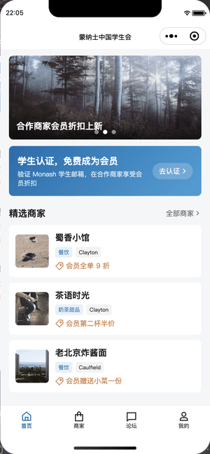
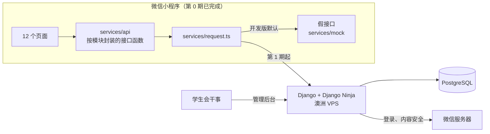

# 蒙纳士中国学生会小程序

[](https://github.com/Jerry2003826/MonashStudentMiniprogram/actions/workflows/ci.yml)

给 Monash University 中国同学用的微信小程序：验证学生邮箱后免费成为会员，出示电子会员卡在合作商家享受折扣，还能在论坛里交流二手、租房、学习和求助。

> **当前进度：第 0 期已完成。** 需求文档、技术方案、工程底座和 12 个页面的可点击原型都已经做好。原型使用内存里的假数据运行，不需要后端；Django 后端从第 1 期开始做。页面里的商家、用户和帖子都是虚构的示例数据。

<p align="center">
  
</p>

## 目录

- [功能演示](#功能演示)
- [自己动手体验](#自己动手体验)
- [第 0 期做了什么](#第-0-期做了什么)
- [技术架构](#技术架构)
- [目录结构](#目录结构)
- [本地运行](#本地运行)
- [开发和协作](#开发和协作)
- [路线图](#路线图)
- [文档](#文档)

## 功能演示

### 学生认证和电子会员卡

打开小程序会自动静默登录，不需要点任何授权按钮。输入 `@student.monash.edu` 邮箱、填写收到的 6 位验证码，就能免费成为会员，有效期 12 个月；验证码发出后要等 60 秒才能重发。认证后，首页的入口会变成「我的会员卡」。

<table>
  <tr>
    <td align="center"><br>访客首页</td>
    <td align="center"><br>学生认证</td>
    <td align="center"><br>电子会员卡</td>
    <td align="center"><br>认证后的首页</td>
  </tr>
</table>

商家只看卡面、不扫码，所以会员卡的渐变背景一直在流动，时间每秒跳动一次，商家一眼就能分辨实时页面和截图。打开会员卡页时，屏幕会保持常亮。

<p align="center">
  
</p>

### 合作商家

可以按分类和区域筛选商家，也能按名称搜索。详情页显示折扣内容和使用条件，支持一键拨号、打开地图导航，或者复制地址粘贴到 Google Maps。

<table>
  <tr>
    <td align="center"><br>商家列表</td>
    <td align="center"><br>按「奶茶甜品」筛选</td>
    <td align="center"><br>商家详情</td>
  </tr>
</table>

### 论坛

论坛有六个板块，其中「官方公告」只有学生会干事能发帖；支持置顶和关键词搜索。只有认证会员能发帖、评论、点赞和举报。帖子最多带 9 张图，发布前会经过内容安全检测：原型里带「违规」两个字就会被拦下，模拟微信的内容安全接口。评论可以「回复 @某人」。

<table>
  <tr>
    <td align="center"><br>论坛首页</td>
    <td align="center"><br>发帖被内容安全拦截</td>
    <td align="center"><br>修改后发布成功</td>
    <td align="center"><br>点赞、评论和回复</td>
  </tr>
</table>

### 我的

用微信的「头像昵称填写」能力修改头像和昵称；在这里查看会员状态和自己发过的帖子，阅读用户协议和隐私政策，也可以注销账号。

<table>
  <tr>
    <td align="center"><br>我的</td>
    <td align="center"><br>我的帖子</td>
    <td align="center"><br>隐私政策（示例文字）</td>
  </tr>
</table>

## 自己动手体验

按[本地运行](#本地运行)打开项目后，可以照着下面的顺序把所有功能走一遍：

1. 模拟器里默认是访客状态的首页。
2. 在「我的」里点头像换一张图，点昵称改个名字。昵称里带「违规」会被拦截，并恢复原来的昵称。
3. 回首页点「学生认证」，输入任意 `@student.monash.edu` 邮箱，验证码填 `123456`。
4. 认证成功后会自动打开电子会员卡，可以看到时间在跳动；回到首页，入口已经变成「我的会员卡」。
5. 到「商家」页试试筛选和搜索（比如搜 `kiwi`），再进详情页试试拨号、导航和复制地址。
6. 到「论坛」发一条帖子：正文带「违规」会被拦下，去掉后就能发布，新帖子排在置顶帖后面。
7. 进帖子详情点赞、评论、回复别人。长按评论可以举报，或者删除自己的评论；右上角「…」可以举报，或者删除自己的帖子。

假数据只保存在内存里，重新编译后会回到初始状态。

## 第 0 期做了什么

| 部分           | 内容                                                                                                                                                                                                                                                            |
| -------------- | --------------------------------------------------------------------------------------------------------------------------------------------------------------------------------------------------------------------------------------------------------------- |
| 需求和方案     | [需求文档](docs/requirements.md)写清楚了功能范围、第一版明确不做的功能、分期计划和验收标准。[技术方案](docs/tech-design.md)包括架构、数据模型、完整的接口清单和 14 个错误码，登录、学生认证和内容安全的流程，以及部署方案和分工建议。                           |
| 小程序原型     | 12 个页面、2 个公共组件，技术栈是原生小程序、TypeScript（strict 模式）和 TDesign 组件库。                                                                                                                                                                       |
| 接口层和假数据 | 统一的请求封装负责带 token、登录失效时自动重新登录，并统一转换错误格式。23 个假接口按技术方案的业务规则实现，包括验证码冷却、会员有效期和续期、发帖权限和图片审核，所以前端不用等后端就能开发。                                                                 |
| 质量保障       | 109 个 Vitest 单元测试，覆盖请求封装、假接口规则和工具函数；GitHub Actions 在每次推送时自动跑类型检查、代码检查、格式检查和单元测试；另有 12 个页面的[手动测试清单](docs/test-checklist.md)。开发过程中还用微信开发者工具的自动化接口逐页点击，验证了每个页面。 |
| 工程细节       | TDesign 默认从腾讯 CDN 在线加载图标字体，在澳洲访问很慢（实测最慢一次要 76 秒），所以改成裁剪后内嵌；按错误码和状态分支的地方都用 `never` 检查兜底，新增状态时编译器会提示哪里漏了处理。                                                                        |

代码规模：约 3,600 行 TypeScript、1,800 行页面模板和样式、1,300 行测试。

## 技术架构



- **小程序**：原生小程序、TypeScript（strict 模式）、TDesign 小程序组件库。
- **测试和工具**：Vitest、ESLint、Prettier、GitHub Actions。
- **后端（第 1 期）**：Python、Django 5.2 + Django Ninja、PostgreSQL，用 Docker Compose 和 Caddy 部署在澳洲的 VPS 上。

页面只调用 `services/api/` 里的函数，所有请求都经过 `services/request.ts`。开发版默认把请求交给 `services/mock/` 里的假接口；第 1 期后端完成后，把 `miniprogram/config.ts` 里的 `MOCK_IN_DEVELOP` 改成 `false` 就能切到真接口。详细设计见[技术方案](docs/tech-design.md)。

## 目录结构

```text
.
├── miniprogram/              # 小程序源码
│   ├── pages/                # 12 个页面
│   ├── components/           # 商家卡片、帖子卡片
│   ├── custom-tab-bar/       # 底部标签栏
│   ├── services/             # 请求封装、登录状态、接口函数、假接口
│   ├── types/api.ts          # 前后端的接口约定
│   ├── utils/                # 格式化、校验、会员状态文案等纯函数
│   ├── styles/               # 内嵌的图标字体（脚本生成）
│   └── config.ts             # 运行环境、接口地址、假数据开关
├── tests/miniprogram/        # 单元测试
├── scripts/                  # 生成内嵌图标字体的脚本
├── docs/                     # 需求文档、技术方案、贡献指南、测试清单、实施计划
└── .github/workflows/ci.yml  # CI
```

## 本地运行

需要先安装[微信开发者工具](https://developers.weixin.qq.com/miniprogram/dev/devtools/download.html)和 Node.js 22 或 24。

```bash
git clone https://github.com/Jerry2003826/MonashStudentMiniprogram.git
cd MonashStudentMiniprogram
npm ci
```

1. 在微信开发者工具里选择「导入项目」，目录选仓库根目录。
2. 点菜单「工具 → 构建 npm」。
3. 点「编译」，模拟器里出现首页就可以开始体验了。想在手机上看，用「预览」扫码打开开发版。

常用命令：

| 命令                  | 作用                                 |
| --------------------- | ------------------------------------ |
| `npm run typecheck`   | TypeScript 类型检查                  |
| `npm run lint`        | ESLint 代码检查                      |
| `npm run format`      | 用 Prettier 自动格式化               |
| `npm test`            | 运行单元测试                         |
| `npm run build:icons` | 重新生成内嵌图标字体（用到新图标时） |

## 开发和协作

每个任务从 `main` 拉一个分支，完成后提 PR；CI 通过并经过技术负责人 review 后，用 squash 方式合并。环境准备、代码约定和常见问题见[贡献指南](docs/contributing.md)，合并前按[手动测试清单](docs/test-checklist.md)自测改动涉及的页面。

## 路线图

| 阶段     | 内容                                                                                                | 状态   |
| -------- | --------------------------------------------------------------------------------------------------- | ------ |
| 第 0 期  | 需求文档、技术方案、工程底座、12 个页面的假数据原型                                                 | 已完成 |
| 第 1 期  | Django 后端：微信登录、学生邮箱认证、会员卡、首页和商家接口、管理后台、服务器部署；前端切换到真接口 | 计划中 |
| 第 2 期  | 论坛后端：发帖、评论、点赞、举报、内容安全检测、版主后台                                            | 计划中 |
| 正式上线 | 切换到学生会的小程序账号，提交审核                                                                  | 计划中 |

## 文档

- [需求文档](docs/requirements.md)：第一版做什么、不做什么，分期和验收标准
- [技术方案](docs/tech-design.md)：架构、数据模型、接口清单、部署和分工
- [贡献指南](docs/contributing.md)：怎么装环境、怎么开发、怎么提 PR
- [手动测试清单](docs/test-checklist.md)：每个页面要检查的内容
- [第 0 期实施计划](docs/plans/2026-09-24-phase0-prototype.md)：第 0 期的任务拆分和执行记录
