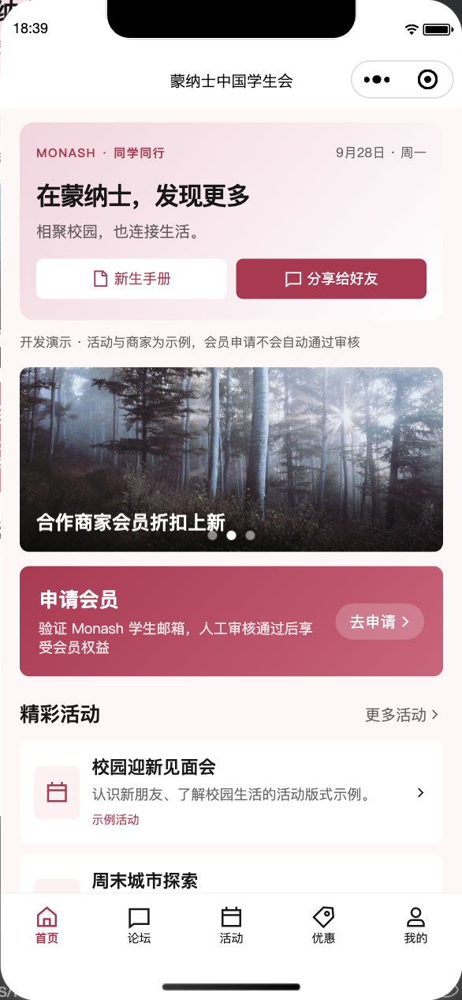
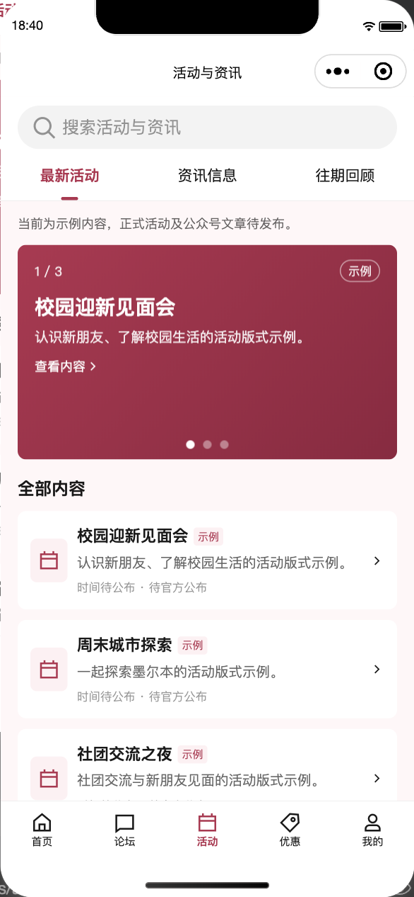
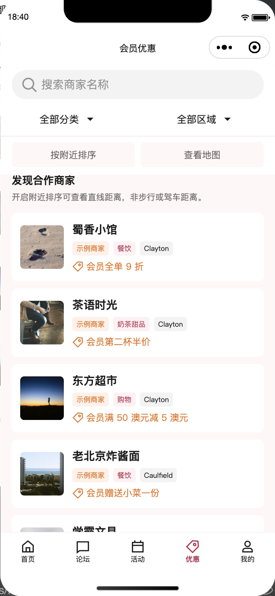
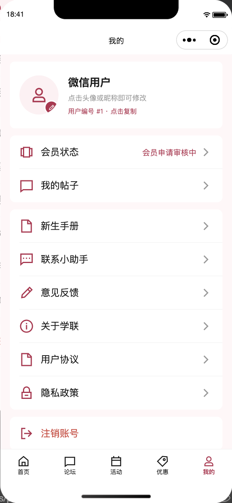
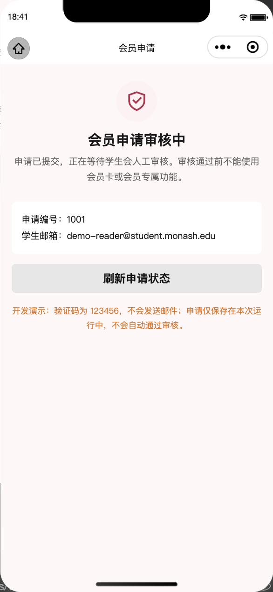
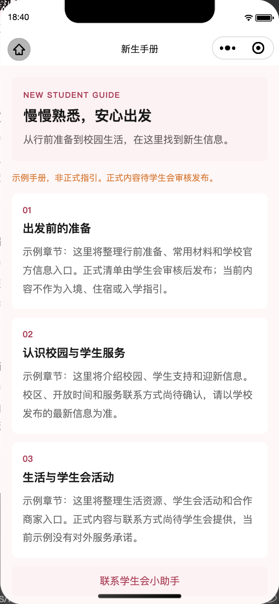
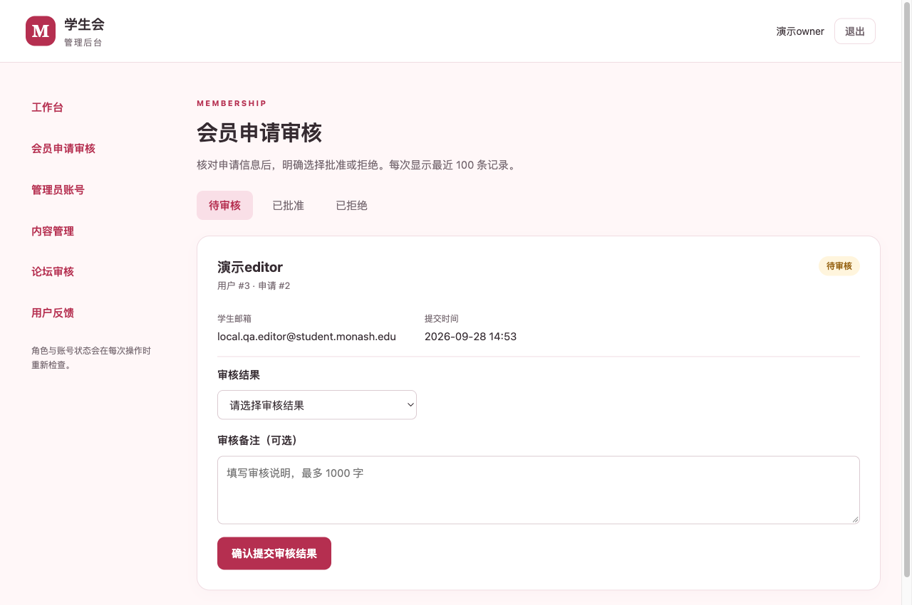
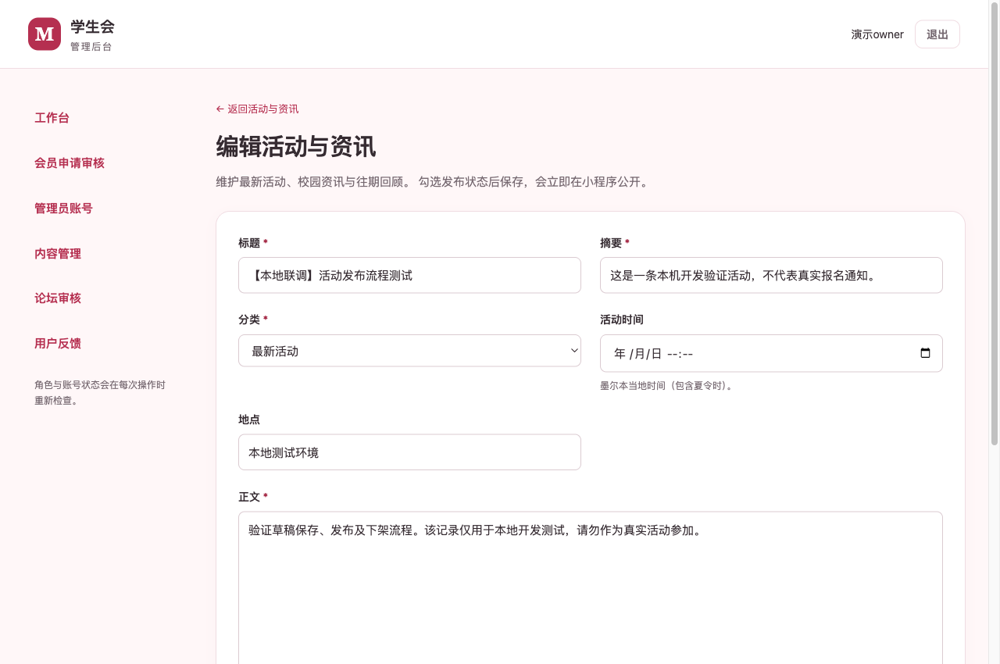
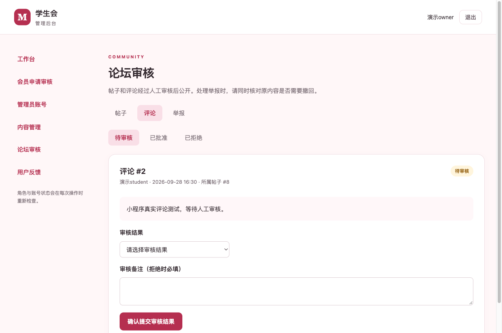
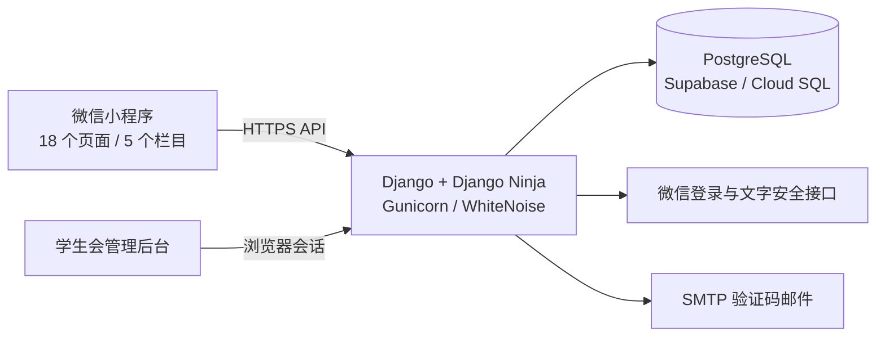

# 蒙纳士中国学生会小程序

[](https://github.com/Jerry2003826/MonashStudentMiniprogram/actions/workflows/ci.yml?query=branch%3AJiarui%2Fplanning-alignment)

面向 Monash University 中国同学的校园服务小程序：看活动、找优惠、读新生手册、参与文字交流，并通过人工审核申请电子会员卡。学生会干事在独立管理后台维护内容、审核会员与论坛、处理反馈。

**当前版本：18 个页面 · 5 个底部栏目 · 会员与内容后台 · 可迁移 PostgreSQL。**

> 更新于 **2026-09-28**。当前功能位于 `Jiarui/planning-alignment` 分支，尚未合并到 `main`。本地联调、生产容器和数据库迁移演练已完成；**尚未部署到公网，也没有可用的微信体验版二维码**。源码默认使用模拟数据，真实服务需要按部署手册配置。

[界面预览](#界面预览) · [功能与流程](#功能与流程) · [快速开始](#快速开始) · [部署与迁移](#部署与迁移) · [测试与验证](#测试与验证) · [文档导航](#文档导航)

## 界面预览

以下截图来自当前源码在微信开发者工具中的 **390px 模拟器**，使用明确的演示数据。没有真实发送验证码、授予会员资格或发布商家优惠；下方另有连接本地数据库的管理后台截图。截图日期、运行模式和页面来源见[截图说明](docs/images/README.md)。

<table>
  <tr>
    <td align="center"><br><strong>首页</strong><br>活动与校园服务入口</td>
    <td align="center"><br><strong>活动</strong><br>最新活动、资讯与往期回顾</td>
    <td align="center"><br><strong>优惠</strong><br>分类筛选与附近商家入口</td>
  </tr>
  <tr>
    <td align="center"><br><strong>论坛</strong><br>文字交流与内容审核</td>
    <td align="center"><br><strong>我的</strong><br>会员、手册与支持服务</td>
    <td align="center"><br><strong>会员申请</strong><br>邮箱验证后进入人工审核</td>
  </tr>
</table>

论坛截图中的图片是预置示例素材，当前发帖仅支持文字；「我的」中的头像修改与注销也只在 mock 中演示。

<details>
  <summary>更多页面：新生手册与帖子详情</summary>
  <p>
    
    
  </p>
</details>

## 功能与流程

| 模块       | 当前已实现                                                                                 |
| ---------- | ------------------------------------------------------------------------------------------ |
| 首页与活动 | 首页活动入口、轮播、三类活动列表、搜索、详情、分享；加载失败和空内容有明确提示             |
| 商家优惠   | 分类、区域和名称筛选，商家详情、使用条件、地址；主动授权后显示附近排序、直线距离与地图标记 |
| 会员申请   | 微信身份交换、学生邮箱验证码、待审核/批准/拒绝、续期审核、有效期检查与电子卡               |
| 文字论坛   | 按板块浏览、搜索、帖子与评论、回复、点赞、举报、我的帖子；帖子和评论审核通过后公开         |
| 手册与支持 | 新生手册、联系小助手、意见反馈；真实后端保存反馈并支持后台处理                             |
| 管理后台   | 活动、商家、轮播、手册的编辑/发布/下架，联系信息维护；会员审批、论坛审核、举报与管理员管理 |
| 角色与登录 | 负责人、会员审核员、内容编辑三类权限；浏览器配对码由已绑定管理员在小程序内确认             |
| 上线准备   | 非 root 容器、HTTPS 配置、静态资源、健康/就绪检查、配置预检与独立体验版构建                |

### 会员由管理员审核后生效

学生邮箱验证 → **待审核** → 管理员批准或拒绝 → 批准后取得有效期内的会员资格。续期同样需要审核。

- 待审核用户不能取得有效会员卡，客户端没有自行批准的入口。
- 管理员身份与会员资格分别校验；拥有后台角色不等于自动成为会员。
- 会员卡在重新打开及到期时检查资格，演示卡和内测卡不能作为真实优惠凭证。
- 真实昵称、帖子、评论和反馈接入微信文字安全检测；检测不可用时阻止保存。帖子和评论另需人工审核。真实微信凭据尚待联调。

### 独立管理后台

后台由 Django 提供，业务数据持久保存。以下为 **当前源码 + 本地 SQLite 演示库副本**，不是线上环境；没有为截图修改原库的审批结果或管理员角色。

<p align="center">
  <br>
  <em>会员申请审核：查看申请资料，选择审核结果并填写备注</em>
</p>

<p align="center">
  <br>
  <em>活动编辑：维护标题、摘要、分类、时间、地点与正文</em>
</p>

<p align="center">
  <br>
  <em>论坛审核：查看待审核评论，选择结果并记录理由</em>
</p>

| 角色       | 后台权限                                           |
| ---------- | -------------------------------------------------- |
| 负责人     | 管理账号、会员审批、内容与论坛管理                 |
| 会员审核员 | 会员申请审核；不能管理其他账号或内容               |
| 内容编辑   | 内容、论坛、举报和反馈处理；不能管理账号或审批会员 |

正式管理员登录采用“浏览器生成配对码 → 小程序管理员确认 → 原浏览器获得会话”。本地演示登录只允许明确开启的开发环境；账号停用或角色变化后会重新校验访问权限。

### 当前范围与待接入项

- **论坛图片、头像上传、自助注销**：真实服务尚未开放；头像与注销仅在 mock 中演示，真实模式提供账号与数据请求说明。
- **天气、汇率、真实会员统计、Wallet、社团功能**：尚未实现或接入，页面不展示伪造的实时结果。
- **地图**：已有原生地图标记和附近排序；底图、定位授权与真实设备表现仍需验收，尚未接入 OSM/Mapbox。
- **正式论坛板块**：本地演示预置六个板块；正式空库迁移不会自动生成板块，后台尚无板块创建入口。上线前须补齐正式板块初始化，不能用演示种子命令替代。
- **正式内容与外部服务**：商家合作资料、公众号文章、真实微信调用、SMTP 送达、云端域名和隐私信息仍需配置与验证。

## 快速开始

### 只体验界面和模拟流程

需要 **Node.js 24**（见 [`.nvmrc`](.nvmrc)）与[微信开发者工具](https://developers.weixin.qq.com/miniprogram/dev/devtools/download.html)。

```sh
git clone --branch Jiarui/planning-alignment https://github.com/Jerry2003826/MonashStudentMiniprogram.git
cd MonashStudentMiniprogram
npm ci
npm run prepare:components
```

在微信开发者工具中导入仓库根目录并编译。组件准备脚本从锁定版本的 TDesign 包生成 `miniprogram/miniprogram_npm`，新克隆、更新依赖和 CI 都使用相同流程，无需提交生成的依赖文件。

默认 `MOCK_IN_DEVELOP=true`，不需要云数据库或 SMTP 即可浏览界面：

1. 浏览首页、活动、商家、论坛、新生手册和联系入口。
2. 申请会员时使用演示学生邮箱与固定验证码 `123456`；提交后保持待审核，不会自动开卡。
3. 提交模拟反馈时会显示“未实际发送”。mock 数据保存在内存中，重新编译后恢复初始状态。

### 联调真实本地后端

需要 **Python 3.12+ 与 uv**。按 [server/README.md](server/README.md) 配置环境、运行 migrations 和创建演示账号。

| 入口              | 地址                                |
| ----------------- | ----------------------------------- |
| 管理后台          | <http://127.0.0.1:8000/manage/>     |
| 开发模式 API 文档 | <http://127.0.0.1:8000/api/v1/docs> |
| 存活检查          | <http://127.0.0.1:8000/healthz>     |
| 数据库就绪检查    | <http://127.0.0.1:8000/readyz>      |

本地后端使用 SQLite 持久化，随机验证码写入 `server/var/emails/`，不向外发送。关闭前端 mock 并选择本地开发身份后，可验证完整的“申请 → 审批 → 会员卡”和“提交文字 → 人工审核 → 公开”流程。开发登录与模拟内容检测仅供明确开启的 loopback 环境，不能用于共享测试或公网部署。

## 部署与迁移

**业务基础设施不依赖微信云资源。** 选定方案为 **Google Cloud Run + Supabase PostgreSQL**，后续可迁往 Google Cloud SQL；不启用微信云开发、云函数、云托管、云数据库或云存储。微信登录、内容检测和小程序发布作为平台接口单独接入。



图示为真实服务架构；云端尚未开通。本地开发可使用 SQLite 或纯前端 mock。

- **容器与密钥**：生产镜像使用非 root 用户，排除本地密钥、数据库与测试 fixtures；数据库迁移单独执行。Google Cloud 的密钥通过 Secret Manager 注入。
- **数据库迁移**：通过标准 Django ORM 和 `DATABASE_URL` 连接。已提供导出、空库导入、逐模型校验与回滚说明，并完成 SQLite → PostgreSQL → SQLite 搬迁演练。
- **体验版构建**：填写真实公开配置后，构建脚本生成独立目录和文件哈希清单，强制真实 HTTPS API，关闭 mock 和开发身份；不会自动上传微信。

```sh
npm run check:trial -- --config deploy/trial-config.json
npm run prepare:trial -- --config deploy/trial-config.json --output artifacts/trial-0.1.0
```

以上命令需要先根据 [公开配置模板](deploy/trial-config.example.json) 填写真实 API 地址、运营方、联系方式、部署区域和保留政策。空配置会被拒绝；离线 `synthetic` 检查包主动禁止联网，不能作为可用体验版发布。

部署顺序、费用边界、云配置、真机验收和回滚见[部署手册](deploy/README.md)；数据库搬迁见[迁移说明](docs/database-migration.md)。

## 测试与验证

当前代码的[GitHub CI 已通过](https://github.com/Jerry2003826/MonashStudentMiniprogram/actions/runs/36394414362)，四组任务覆盖前端、SQLite、PostgreSQL 16 与生产容器。通过 CI 不代表真实微信、SMTP 或公网环境已经验收。

| 验证范围           | 已记录结果                                                |
| ------------------ | --------------------------------------------------------- |
| 前端               | 238 项测试通过；TypeScript、ESLint、Prettier 通过         |
| 后端 SQLite        | 424 项通过，1 项 PostgreSQL 专用并发测试跳过              |
| 后端 PostgreSQL 16 | 425 项通过，包含并发审核与迁移相关测试                    |
| 生产容器           | 20 项检查通过；Linux arm64 与 amd64 均已本地验证          |
| 微信开发者工具     | 18 页完成离线运行检查，后续改动页复验通过；真机仍待联调   |
| 数据库搬迁         | 19 个模型、56 条演示业务记录双向搬迁并核对字段和关联      |
| 全新环境           | `npm ci` → 组件准备 → 类型、代码、格式检查 → 全套测试通过 |

常用检查：

```sh
npm run typecheck
npm run lint
npm run format:check
npm test
cd server
uv run ruff check .
uv run ruff format --check .
uv run pytest
```

生产模式冒烟测试需要 Docker；在仓库根目录另开终端执行：

```sh
cd server
uv run python -m ops.container_smoke --report var/container-smoke-report.json
```

该测试启动独立的 PostgreSQL 16 和生产应用容器，检查权限、HTTPS、静态资源、数据库迁移状态与重启后的持久化，并清理本次创建的容器和卷。

## 项目结构

```text
miniprogram/             小程序页面、组件、接口封装、模拟服务
server/                 Django API、管理后台、数据库迁移和测试
scripts/                组件准备、体验版构建、内嵌图标字体工具
tests/miniprogram/       前端行为与构建测试
deploy/                 Cloud Run / Supabase 部署方案和配置模板
docs/                   需求、设计、实施记录、验证报告与截图
.github/workflows/      四组 CI 检查
```

## 文档导航

| 文档                                                                  | 内容                                        |
| --------------------------------------------------------------------- | ------------------------------------------- |
| [本地后端与联调](server/README.md)                                    | 环境、演示账号、邮件文件、管理员配对登录    |
| [测试环境部署](deploy/README.md)                                      | 独立云架构、配置预检、发布与回滚            |
| [数据库迁移](docs/database-migration.md)                              | Supabase / Cloud SQL 配置、导出、导入、校验 |
| [上线准备验证](docs/qa/2026-09-28-staging-readiness.md)               | 测试结果、容器验证、真实服务待验收项        |
| [内容与审核实现](docs/plans/2026-09-28-content-backend.md)            | 内容持久化、论坛审核、角色和接口边界        |
| [会员与权限实现](docs/plans/2026-09-28-membership-backend.md)         | 人工审批、会员有效期、管理员角色            |
| [规划对齐记录](docs/plans/2026-09-28-planning-alignment.md)           | 原工作规划与当前实现范围                    |
| [截图说明](docs/images/README.md)                                     | 当前页面、模式、日期与历史图片边界          |
| [贡献指南](docs/contributing.md) / [测试清单](docs/test-checklist.md) | 开发流程与人工验收                          |

[早期需求](docs/requirements.md)、[技术设计](docs/tech-design.md)和[第 0 期计划](docs/plans/2026-09-24-phase0-prototype.md)保留历史背景；其旧版四栏目、验证即开卡和图片发帖描述不作为当前实现说明。旧截图仍保留供历史记录引用，本 README 只展示本次重新截取的界面。
