# 蒙纳士中国学生会小程序

[](https://github.com/Jerry2003826/MonashStudentMiniprogram/actions/workflows/ci.yml)

面向 Monash University 中国同学的微信小程序，提供活动资讯、校园交流、合作商家优惠、新生手册与会员卡入口。

> **当前进度：已完成测试环境部署准备与本地生产模式验证（2026-09-28）。** 5 个底部栏目、18 个小程序页面；前端 238 项、后端 PostgreSQL 16 下 425 项测试通过。已加入生产容器、微信文字安全检测、上线预检和独立体验版构建；数据库可迁往 Supabase 或 Google Cloud SQL。源码默认仍使用 mock，体验版构建强制真实服务。**云资源、微信密钥、SMTP 和合法域名尚未就绪，尚未上线。** 见[部署方案](deploy/README.md)、[本轮验证报告](docs/qa/2026-09-28-staging-readiness.md)和[本地启动](server/README.md)。

<table>
  <tr>
    <td align="center">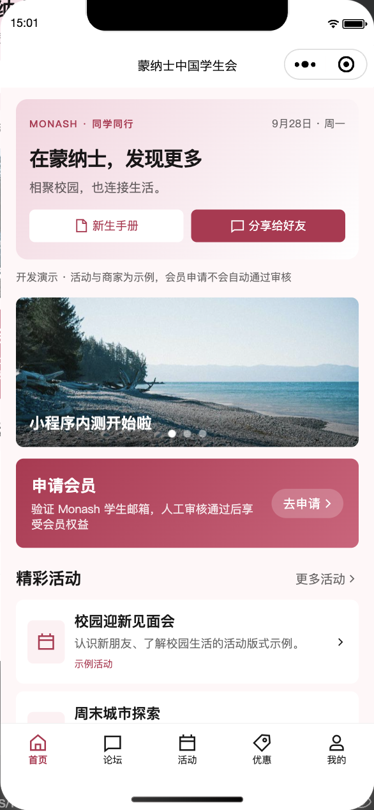<br>首页</td>
    <td align="center"><br>活动</td>
    <td align="center"><br>反馈演示</td>
  </tr>
</table>

## 目录

- [功能演示](#功能演示)
- [自己动手体验](#自己动手体验)
- [当前原型范围](#当前原型范围)
- [第 0 期做了什么](#第-0-期做了什么)
- [技术架构](#技术架构)
- [目录结构](#目录结构)
- [本地运行](#本地运行)
- [开发和协作](#开发和协作)
- [路线图](#路线图)
- [文档](#文档)

## 当前原型范围

- **内容与审核后台**新增活动、商家、轮播、手册、联系设置的编辑/发布/下架；论坛文字帖与评论人工审核、置顶、举报处理；反馈保存与处理。负责人和内容编辑员可用，会员审核员无内容权限。

- **会员与管理员后台**提供真实本地服务：邮箱验证码、待审/拒绝/批准、续期审核、有效卡授权、管理账号角色/停用、浏览器与小程序配对登录。客户端没有自行批准或提权入口。

- **首页、论坛、活动、优惠、我的**五栏目，统一粉白主题与底部安全区；首页展示日期、前三条活动、手册和会员入口。
- **活动**分最新活动、资讯与往期回顾，支持轮播、搜索、详情、分享和无效链接返回。公众号文章入口已封装，但尚无正式文章链接可联调。
- **优惠**保留分类、区域和名称筛选，新增用户主动授权的附近排序、直线距离与地图标记。拒绝定位仍可浏览和搜索，商家详情不依赖登录成功。当前使用微信原生地图，尚未接入规划指定的 OSM/Mapbox；开发者工具中底图仍未显示，不能视为完整地图验收通过。
- **手册、联系与反馈**包含加载、失败、空内容和联系方式缺失状态；反馈校验输入、防重复提交并明确显示“未实际发送”。
- **天气、汇率**显示服务准备中；真实排名、领馆公告、有效会员数、Wallet 留待后续接入。

已通过 TypeScript、ESLint、Prettier、Django 系统/迁移、Ruff 检查。前端 238 项测试通过；后端 PostgreSQL 16 下 425 项通过，SQLite 424 项通过并跳过 1 项专用行锁测试。生产容器 20 项检查通过；结果边界见[上线准备验证报告](docs/qa/2026-09-28-staging-readiness.md)。[数据库迁移报告](docs/qa/2026-09-28-database-migration.md)记录了 56 条业务数据的双向搬迁验证；[内容后台验证报告](docs/qa/2026-09-28-content-backend.md)覆盖小程序、浏览器与数据库；前一批后台和真实本地 HTTP 联调见[会员后台验证报告](docs/qa/2026-09-28-membership-backend.md)；第一批活动/地图/支持内容记录见[前端原型验证报告](docs/qa/2026-09-28-planning-alignment.md)。

<p align="center">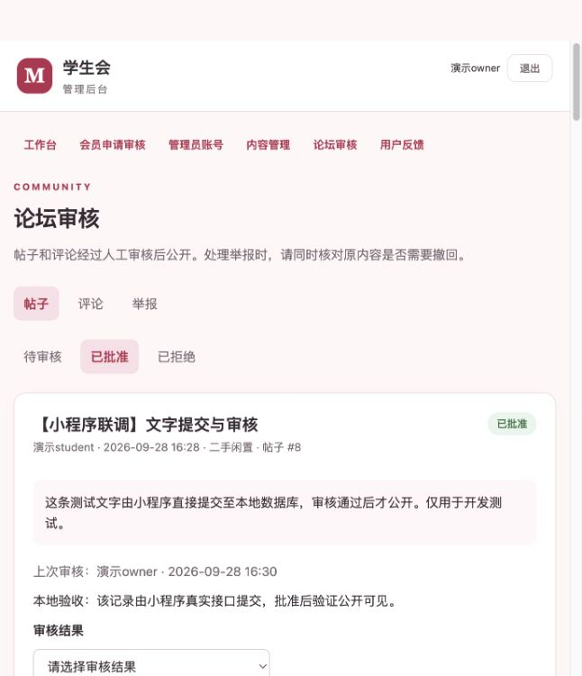</p>

## 功能演示

以下截图和动图保留自第 0 期，用于说明已有交互；布局与四栏导航属于历史版本，第一批五栏界面见上方截图，会员文案已经进一步改为人工审核。默认 mock 不会发送邮件、真正发布帖子或自动批准会员。

### 学生认证和电子会员卡

当前 mock 中输入学生邮箱和演示验证码 `123456` 只会进入待审核状态，不会自动发卡。本地后端使用随机验证码和文件邮件，管理员在后台批准后才创建资格；续期同样需要审核。以下认证即开卡的截图属于已废弃的第 0 期流程。

<table>
  <tr>
    <td align="center"><br>访客首页</td>
    <td align="center">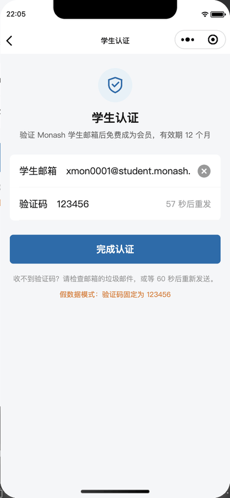<br>学生认证</td>
    <td align="center">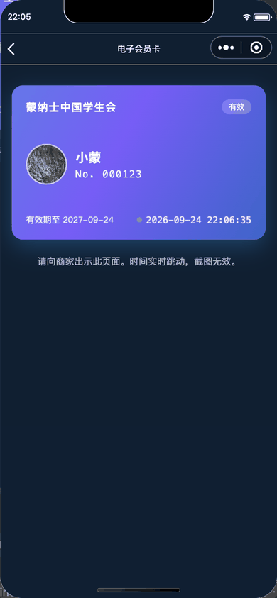<br>电子会员卡</td>
    <td align="center">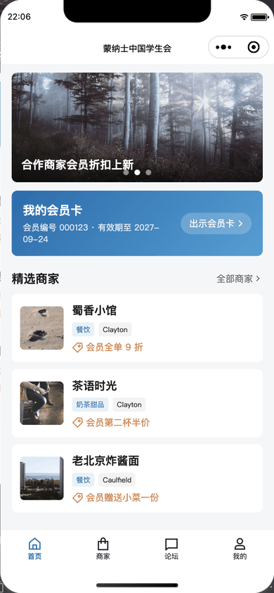<br>认证后的首页</td>
  </tr>
</table>

卡面有动态渐变和实时钟表，重新显示页面时刷新资格，停留期间到期也会变为无效。演示卡有明确标记，不能用于实际优惠；动态效果本身不是可靠的防伪机制，真实商家核验方式需在上线前确定。

<p align="center">
  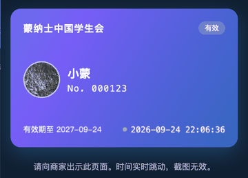
</p>

### 合作商家

可以按分类和区域筛选商家、按名称搜索，也可主动开启附近排序。详情页显示示例折扣和使用条件，提供拨号、打开地图和复制地址入口；真实商家资料与设备能力需另行验收。

<table>
  <tr>
    <td align="center">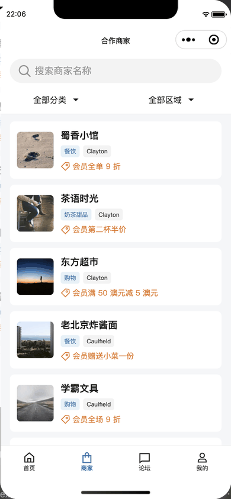<br>商家列表</td>
    <td align="center">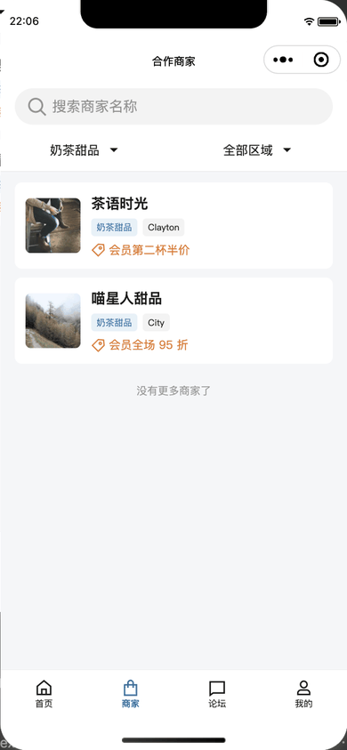<br>按「奶茶甜品」筛选</td>
    <td align="center">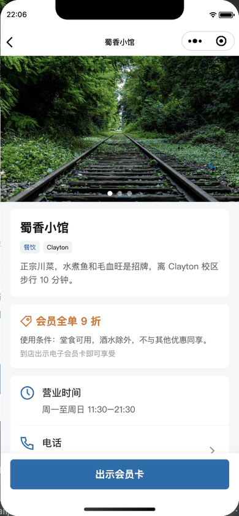<br>商家详情</td>
  </tr>
</table>

### 论坛

论坛有六个板块，公开内容无需登录即可浏览；有效会员可提交文字帖子、评论、点赞和举报，官方公告还要求内容管理角色。帖子与评论先进入人工审核，批准后公开；支持置顶、搜索和回复本帖参与者。新图片上传尚未开放，真实微信内容安全尚未联调。下方图片上传和立即发布截图为第 0 期历史流程。

<table>
  <tr>
    <td align="center">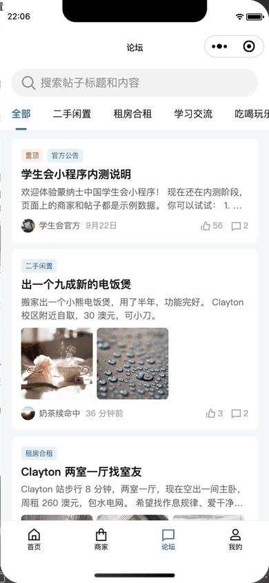<br>论坛首页</td>
    <td align="center">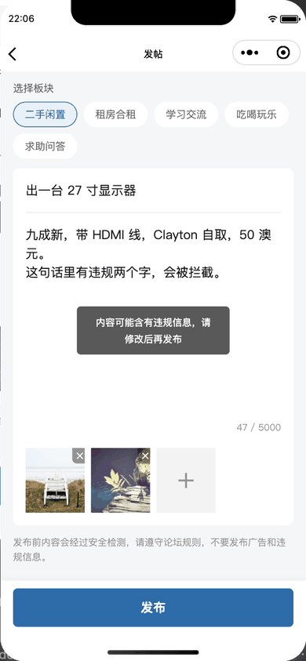<br>发帖被内容安全拦截</td>
    <td align="center"><br>修改后发布成功</td>
    <td align="center">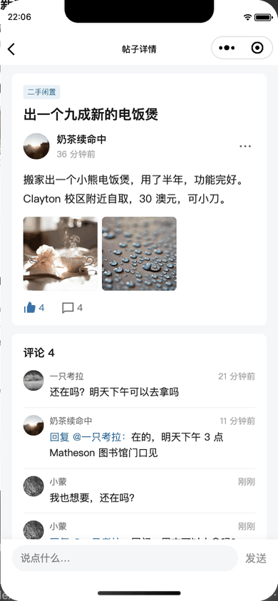<br>点赞、评论和回复</td>
  </tr>
</table>

### 我的

在这里查看会员和审核状态、自己的帖子、用户编号及管理员登录入口。昵称可连接本地服务；头像和注销仍只在 mock 中演示，真实接口待实现。下方为历史原型截图。

<table>
  <tr>
    <td align="center">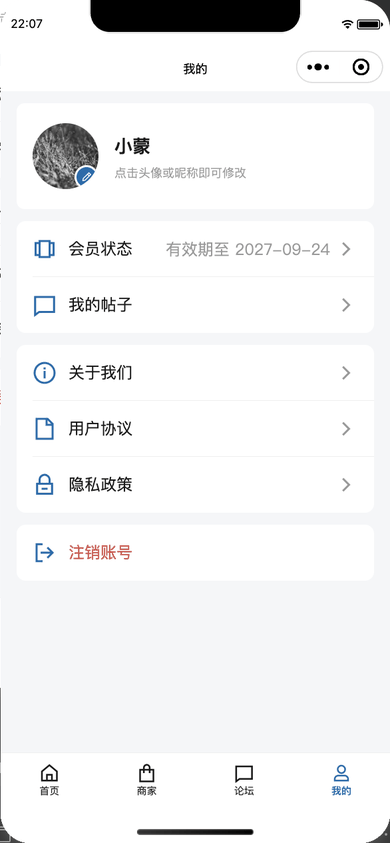<br>我的</td>
    <td align="center"><br>我的帖子</td>
    <td align="center">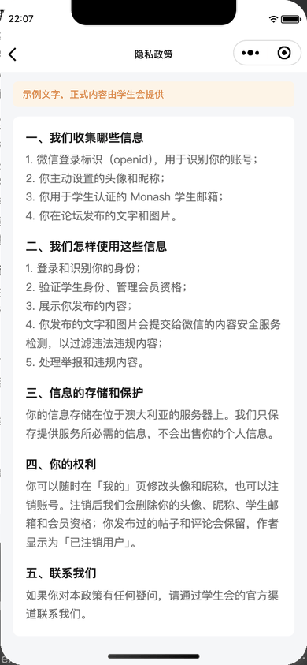<br>隐私政策（示例文字）</td>
  </tr>
</table>

## 自己动手体验

按[本地运行](#本地运行)打开项目后，可以照着下面的顺序体验主要流程：

1. 模拟器里默认是访客状态的首页。
2. 在「我的」里点头像换一张图，点昵称改个名字。昵称里带「违规」会被拦截，并恢复原来的昵称。
3. 回首页点「申请会员」，输入演示学生邮箱并发送模拟验证码，再填 `123456`。
4. 提交后应停在待审核状态，无法出示有效卡；mock 不提供自行批准的按钮。完整审核流程按[后端联调说明](server/README.md)运行。
5. 到「优惠」页试试筛选和搜索（比如搜 `kiwi`）、地图标记和附近排序。拒绝定位后仍能浏览；请勿拨打示例商家的号码。
6. 默认未批准的用户在论坛只能浏览；发帖、评论等会员行为会被拦截，后端角色不等于会员资格。
7. 打开帖子详情查看内容；本地后端支持文字发布、人工审核与持久化；mock 只在本次运行中保留数据。

8. 到「活动」切换三个分类、搜索，再打开详情；无真实公众号链接的示例不会打开文章。
9. 从「我的」进入新生手册、联系小助手和意见反馈。反馈至少 10 字；mock 明确说明“未实际发送”，本地后端可以在管理台查看。

假数据只保存在内存里，重新编译后会回到初始状态。

## 第 0 期做了什么

以下为此前基线交付记录（12 页、109 项测试）；不代表本轮新增功能已经接入真实服务。

| 部分           | 内容                                                                                                                                                                                                                                                            |
| -------------- | --------------------------------------------------------------------------------------------------------------------------------------------------------------------------------------------------------------------------------------------------------------- |
| 需求和方案     | [需求文档](docs/requirements.md)写清楚了功能范围、第一版明确不做的功能、分期计划和验收标准。[技术方案](docs/tech-design.md)包括架构、数据模型、完整的接口清单和 14 个错误码，登录、学生认证和内容安全的流程，以及部署方案和分工建议。                           |
| 小程序原型     | 12 个页面、2 个公共组件，技术栈是原生小程序、TypeScript（strict 模式）和 TDesign 组件库。                                                                                                                                                                       |
| 接口层和假数据 | 统一的请求封装负责带 token、登录失效时自动重新登录，并统一转换错误格式。23 个假接口按技术方案的业务规则实现，包括验证码冷却、会员有效期和续期、发帖权限和图片审核，所以前端不用等后端就能开发。                                                                 |
| 质量保障       | 109 个 Vitest 单元测试，覆盖请求封装、假接口规则和工具函数；GitHub Actions 在每次推送时自动跑类型检查、代码检查、格式检查和单元测试；另有 12 个页面的[手动测试清单](docs/test-checklist.md)。开发过程中还用微信开发者工具的自动化接口逐页点击，验证了每个页面。 |
| 工程细节       | TDesign 默认从腾讯 CDN 在线加载图标字体，在澳洲访问很慢（实测最慢一次要 76 秒），所以改成裁剪后内嵌；按错误码和状态分支的地方都用 `never` 检查兜底，新增状态时编译器会提示哪里漏了处理。                                                                        |

## 技术架构

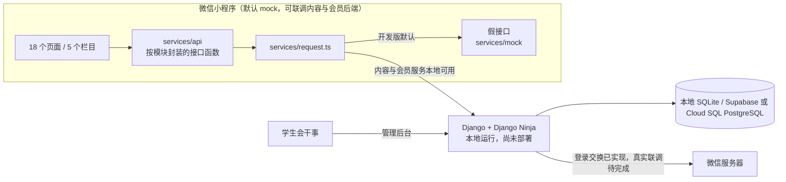

- **小程序**：原生小程序、TypeScript（strict 模式）、TDesign 小程序组件库。
- **测试和工具**：Vitest、ESLint、Prettier、GitHub Actions。
- **后端**：Python、Django 5.2 + Django Ninja；本地 SQLite，已完成 PostgreSQL 回归与迁移演练，可配置 Supabase 或 Google Cloud SQL。真实云端连接与后端部署尚未实施。

页面只调用 `services/api/` 里的函数，所有请求都经过 `services/request.ts`。开发版默认把请求交给 `services/mock/` 里的假接口；真实后端完成并配置接口地址后，才可关闭 `MOCK_IN_DEVELOP` 进行联调；仅切换开关不会产生真实服务。会员与权限的新契约见[本阶段说明](docs/plans/2026-09-28-membership-backend.md)；旧[技术方案](docs/tech-design.md)仅作架构参考。公开内容与文字论坛已接入，新增约定见[内容说明](docs/plans/2026-09-28-content-backend.md)；附件、头像、注销和外部服务仍需后续验收。

## 目录结构

```text
.
├── miniprogram/              # 小程序源码
│   ├── pages/                # 18 个页面
│   ├── components/           # 商家卡片、帖子卡片
│   ├── custom-tab-bar/       # 底部标签栏
│   ├── services/             # 请求封装、登录状态、接口函数、假接口
│   ├── types/                # 既有接口、活动、位置与支持内容类型
│   ├── utils/                # 格式化、校验、会员状态文案等纯函数
│   ├── styles/               # 内嵌的图标字体（脚本生成）
│   └── config.ts             # 运行环境、接口地址、假数据开关
├── server/                   # Django 核心 API、管理页面、迁移与测试
├── tests/miniprogram/        # 单元测试
├── scripts/                  # 生成内嵌图标字体的脚本
├── docs/                     # 需求文档、技术方案、贡献指南、测试清单、实施计划
└── .github/workflows/ci.yml  # CI
```

## 本地运行

需要先安装[微信开发者工具](https://developers.weixin.qq.com/miniprogram/dev/devtools/download.html)和 Node.js 24（版本要求见 `.nvmrc`）。

```bash
git clone https://github.com/Jerry2003826/MonashStudentMiniprogram.git
cd MonashStudentMiniprogram
npm ci
npm run prepare:components
```

组件准备命令将锁定版本的 TDesign 发布目录复制到被 Git 忽略的 `miniprogram/miniprogram_npm/tdesign-miniprogram`，包含组件自带的 npm 依赖；不会改动内嵌图标字体。每次全新克隆或更新依赖后，先运行以上两条命令，再进行类型检查、测试或体验版构建。CI 使用相同步骤，无需启动微信开发者工具。

1. 在微信开发者工具里选择「导入项目」，目录选仓库根目录。
2. 点「编译」，模拟器里出现首页就可以开始体验了。想在手机上看，用「预览」扫码打开开发版。

常用命令：

| 命令                         | 作用                                 |
| ---------------------------- | ------------------------------------ |
| `npm run prepare:components` | 准备锁定版本的小程序组件依赖         |
| `npm run typecheck`          | TypeScript 类型检查                  |
| `npm run lint`               | ESLint 代码检查                      |
| `npm run format`             | 用 Prettier 自动格式化               |
| `npm test`                   | 运行单元测试                         |
| `npm run build:icons`        | 重新生成内嵌图标字体（用到新图标时） |

## 开发和协作

每个任务从 `main` 拉一个分支，完成后提 PR；CI 通过并经过技术负责人 review 后，用 squash 方式合并。环境准备、代码约定和常见问题见[贡献指南](docs/contributing.md)，合并前按[手动测试清单](docs/test-checklist.md)自测改动涉及的页面。

## 路线图

| 阶段           | 内容                                                                      | 状态                         |
| -------------- | ------------------------------------------------------------------------- | ---------------------------- |
| 第 0 期        | 工程底座、四栏目、12 个页面的假数据原型                                   | 历史基线完成                 |
| 规划对齐第一批 | 五栏目、活动、优惠地图与直线距离、手册、联系、反馈；17 页、179 项测试     | 本地完成                     |
| 会员与管理核心 | 微信身份交换、人工审批、管理账号/角色、配对登录、前端申请流程             | 本地完成；真实外部服务待验收 |
| 内容后端       | 活动/商家/首页/手册/联系/反馈持久化，文字论坛人工审核与管理               | 本地完成；社团与附件待实现   |
| 外部服务联调   | 正式内容、天气汇率、会员统计、OSM/Mapbox 选型与接入、公众号文章、真机权限 | 待实施                       |
| 正式上线       | 正式小程序账号配置、隐私与域名核查、全流程验收和平台审核                  | 待实施                       |

## 文档

- [内容后台实施说明](docs/plans/2026-09-28-content-backend.md)：公开内容、文字论坛审核、角色与剩余范围
- [内容后台验证报告](docs/qa/2026-09-28-content-backend.md)：393 项测试与小程序/浏览器/HTTP 证据

- [测试环境部署方案](deploy/README.md)：Cloud Run + Supabase、配置预检、体验包、发布与回滚
- [会员后台实施说明](docs/plans/2026-09-28-membership-backend.md)：状态、角色、接口、开发与生产边界
- [后端启动与联调](server/README.md)：本地服务、随机验证码邮件、管理员登录
- [会员后台验证报告](docs/qa/2026-09-28-membership-backend.md)：277 项测试、本地 UI/HTTP 联调与剩余验收

- [工作规划对齐计划](docs/plans/2026-09-28-planning-alignment.md)：本轮范围、旧需求冲突、下一阶段后端与资料依赖
- [本轮验证报告](docs/qa/2026-09-28-planning-alignment.md)：自动检查、开发者工具验证和未验收项

- [需求文档](docs/requirements.md)：第一版做什么、不做什么，分期和验收标准
- [技术方案](docs/tech-design.md)：架构、数据模型、接口清单、部署和分工
- [贡献指南](docs/contributing.md)：怎么装环境、怎么开发、怎么提 PR
- [手动测试清单](docs/test-checklist.md)：每个页面要检查的内容
- [第 0 期实施计划](docs/plans/2026-09-24-phase0-prototype.md)：第 0 期的任务拆分和执行记录
