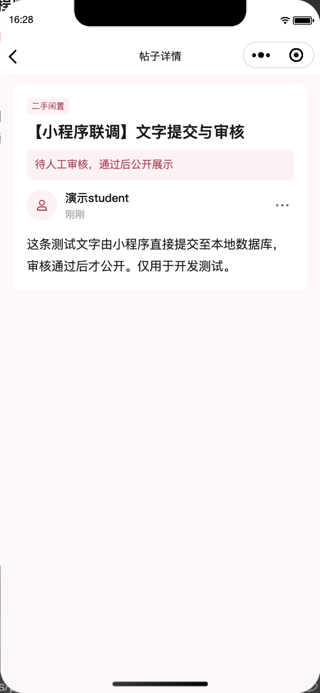
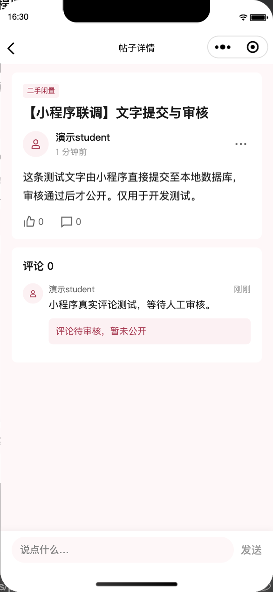
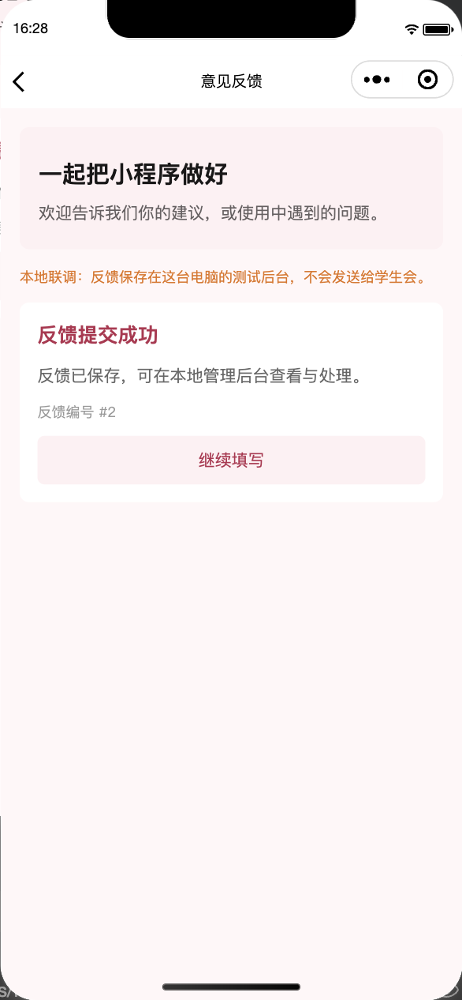
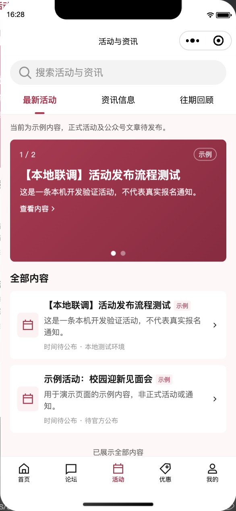

# 内容后端与论坛审核验证记录

2026-09-28，分支 `Jiarui/planning-alignment`。本批本地开发完成；未提交、推送、部署或上传小程序。保留前两批改动，迁移前备份了本地 SQLite 数据库。

## 自动检查

- 前端：27 个测试文件，**206 项通过**；TypeScript、ESLint、Prettier 通过。
- 后端：**187 项通过**，其中核心 42、内容 66、管理台 52、论坛 27；Ruff lint/format、Django 系统检查及迁移一致性检查通过。
- `git diff --check` 通过。数据库、开发邮件、虚拟环境与迁移前备份均被 Git 忽略。
- 本机 Python 3.13.11、Django 5.2.17、Django Ninja 1.7.1、SQLite。CI 配置 Python 3.12，但本轮没有推送运行远端 CI。

内容测试覆盖草稿/下架不可公开、列表过滤/分页、全部匹配商家排序后再分页、非法坐标/网址、公众号原文路径、轮播失效目标过滤、反馈认证/限流/去重、示例种子不覆盖已有编辑。活动时间按墨尔本时区输出，测试包含普通时间与夏令时跨日情况。

论坛测试覆盖无登录读取、无效 token、有效/过期/未审批/禁言会员的写入权限、官方板块权限、私有待审与拒绝内容、只计公开评论、回复参与者校验、作者与管理员删除、重复点赞、举报去重/配额、发布节流、额外审批字段注入、人工审核与审计。图片上传明确拒绝，不自动通过审核。

管理台测试覆盖内容编辑白名单、CSRF、直接 URL/POST 越权、编辑员降权与停用影响已有会话、表单错误、XSS 转义、发布/下架与审核记录、举报目标直达和反馈处理。

## 真实本地 HTTP 与浏览器

全部使用 `seed_demo` 的本地开发身份及明确标记的测试内容，没有真实微信认证、外发邮件或对公网发布。

1. 首页、活动、商家筛选/列表、手册、论坛板块/列表可匿名读取。
2. 浏览器创建活动 #4 为草稿，匿名详情 404、列表中不存在；明确发布后公开接口返回该活动。
3. 有效演示会员通过实际 HTTP 创建帖子 #7，状态为 pending；作者可读取，匿名详情 404，公开列表没有该帖。额外提交 `status=approved` 被 422 拒绝。
4. 浏览器批准帖子后，匿名接口可读取正文；内部审核备注不向普通公共读取返回。
5. 连续两次点赞保持数量为 1。评论 #1 提交后待审，匿名不可见，公开评论数保持 0；后台拒绝后，作者能看见拒绝原因，匿名仍看不到。
6. 相同反馈重试返回同一编号。浏览器保存反馈 #1 的处理状态和备注；举报 #1 可以查看原内容，并保存处理说明。处理举报不会自动删除或改变原帖审核状态。
7. 重启到最终服务代码后，已发布活动/帖子、会员资格、被拒绝评论、反馈与举报处理结果均保留。

浏览器在当前默认约 646px 宽窗口检查，表单和记录单栏显示，文字可换行。未将其声称为 390px 后台真机验收。

## 微信开发者工具直接联调

微信开发者工具基础库 3.17.3，模拟 iPhone 12/13 (Pro)，390 × 844。前端临时关闭 mock、指定 `demo-student` 开发身份并允许本项目 localhost 调试；未替换或拦截 `wx.request` 数据。

- 首页、活动列表/详情、商家和论坛成功读取本地数据库内容，包括浏览器刚发布的活动 #4。
- 使用页面真实提交流程创建帖子 #8，详情显示“待人工审核，通过后公开展示”。
- 浏览器批准该帖后，小程序重新打开详情显示已批准内容；实际输入框填写评论并点击发送，新增评论保持 pending，公开数量不增加。
- 小程序提交反馈 #2，后台可见同一正文；成功页明确标识保存到本机测试后台，不声称已送达学生会。
- 结束后恢复 `MOCK_IN_DEVELOP=true`、`DEVELOPMENT_LOGIN_USERNAME=null`、`urlCheck=true`；清除开发 token 并重新编译，验证默认首页显示普通未审批会员入口。

## 证据

| 小程序待审                                      | 批准后提交评论                                               | 本地反馈回执                                     |
| ----------------------------------------------- | ------------------------------------------------------------ | ------------------------------------------------ |
|  |  |  |

## 尚未验收

真实微信身份与内容安全、SMTP 送达、PostgreSQL 并发、正式 HTTPS/域名与真机；图片/附件/头像上传和账号注销；社团独立目录、OSM/Mapbox 底图、天气汇率、正式内容和商家核验。本地人工审核不代表完成微信平台内容安全要求。

当前小程序默认依然是 mock。启动和切换步骤见[后端 README](../../server/README.md)，最新实现约定见[内容后端说明](../plans/2026-09-28-content-backend.md)。
