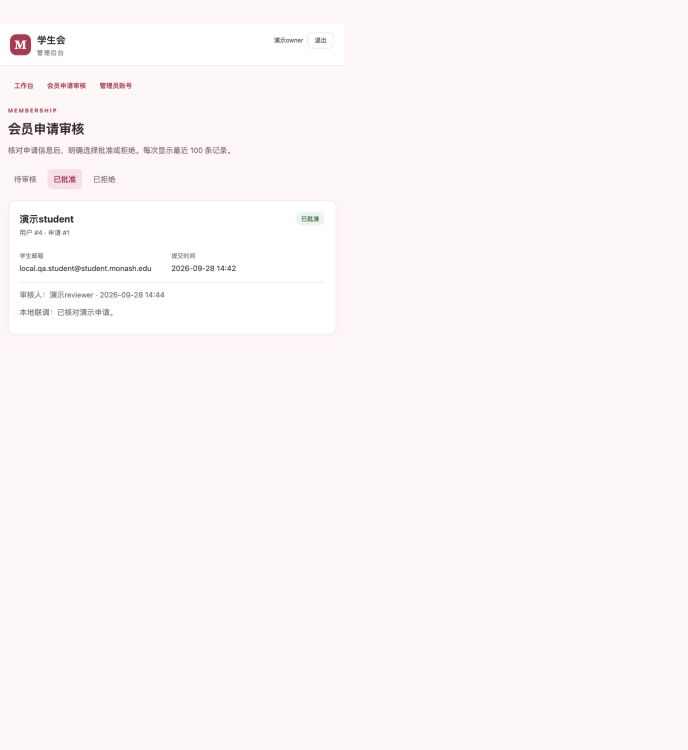
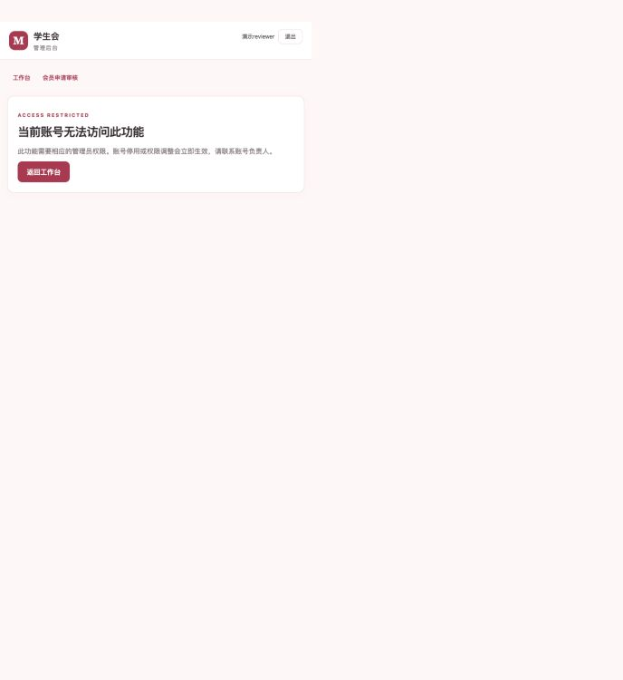
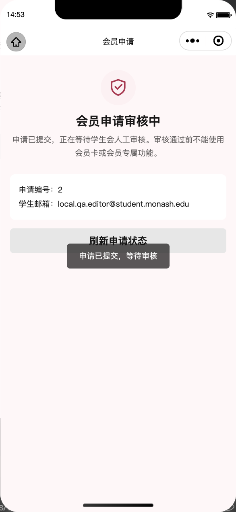
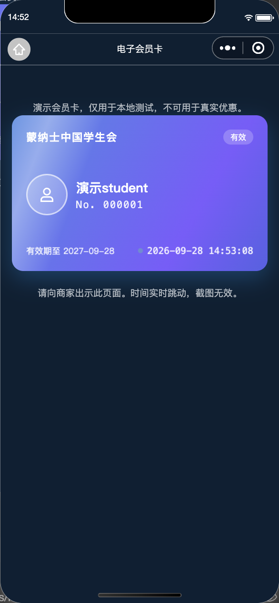
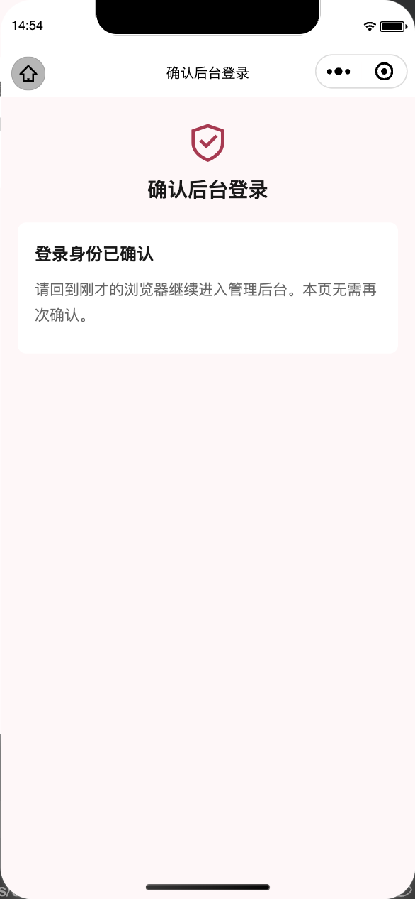

# 会员与管理后台验证记录

日期：2026-09-28。范围为本地 Django 服务与小程序会员/管理流程，分支 `Jiarui/planning-alignment`。本轮未提交、推送、部署或上传小程序。

## 自动检查

- 前端：TypeScript、ESLint、Prettier，26 个测试文件共 **201 项通过**。
- 后端：Ruff lint/format、Django 系统检查、迁移一致性检查，**76 项通过**（核心 42、portal 34）。
- `git diff --check` 通过。
- 本机后端运行环境为 Python 3.13.11、Django 5.2.17、Django Ninja 1.7.1；测试数据库为 SQLite。CI 配置使用 Python 3.12，但本轮尚未推送执行远端 CI。

后端测试覆盖微信失败不假登录、随机 token 的哈希存储、验证码冷却/总量/过期/猜错次数、待审用户卡片 403、字段注入与角色越权、重复审核、续期保留旧有效期、最后负责人保护、邮箱不可跨账号自动转移、撤销资格不可自行恢复、首位负责人初始化和生产配置限制。

管理页面测试覆盖 CSRF、直接 URL/POST 越权、停用与撤权影响已有会话、配对码单次确认/消费/过期/限流、浏览器秘密绑定、不可指定其他用户登录、开发旁路的环境和本机限制。

## 真实本地 HTTP 与浏览器联调

验证使用 `seed_demo` 生成的开发用户和虚构测试邮箱。邮件后端为本地文件，没有外发邮件，也没有调用微信真实账号认证。

1. 开发学生登录后请求会员卡得到 403。发送验证码写入 `server/var/emails/`，正确验证码创建待审申请；会员状态仍为 `none`，没有会员编号，卡接口仍为 403。
2. 提交 `staff_role` 等额外字段被 422 拒绝；普通用户读取账号管理 API 得到 403。
3. 浏览器以演示审核员登录，填写审核结果并批准申请，页面显示“已批准会员申请”；查询学生卡接口随后得到 200 和有效资格。
4. 同一申请再次批准得到 422，到期时间未被重复延长。
5. 审核员直接打开 `/manage/accounts/` 看到无权访问页面；直接请求账号 API 同样得到 403。
6. 负责人通过 API 停用演示审核员，原 token 立即失效；重新启用后旧 token 仍失效。测试后已恢复账号启用状态。
7. 浏览器生成配对码，通过管理身份的 Bearer 请求确认后，原浏览器自动进入该身份的工作台；重复确认被拒绝。
8. 停止并重新启动服务进程后，会员编号、到期日、审批记录保持一致，卡接口仍返回有效资格。

## 小程序直接访问本地后端

微信开发者工具基础库 3.17.3，模拟 iPhone 12/13 (Pro)，390 × 844。临时将前端切到 localhost 后端，并使用显式的 `demo-student` / `demo-editor` 开发登录；未使用 wx.request 的数据替身。

- 已批准的演示学生从真实本地 HTTP 接口读取资格，显示有效会员卡和“演示会员卡，不可用于真实优惠”标记。
- 演示编辑员提交自己的会员申请，前端实际发送邮箱验证码和申请请求；正确码提交后停留在“会员申请审核中”，直达卡片页也没有有效卡。管理身份与会员资格互相独立。
- 在小程序输入浏览器的一次性确认码，输入本身不触发确认；点击“确认登录该浏览器”后，浏览器自动以该编辑员身份登录，界面没有审核或账号管理入口。

原项目开启合法域名校验，本机 HTTP 请求最初返回 `url not in domain list`。仅为本项目本次 localhost 联调临时关闭此校验，结束后已恢复 `urlCheck=true`；前端恢复 `MOCK_IN_DEVELOP=true`、`DEVELOPMENT_LOGIN_USERNAME=null`，并清除测试 token 后重新载入原型。

## 证据

| 后台已批准记录 | 审核员越权被拒绝 |
| --- | --- |
|  |  |

| 小程序待审状态 | 已批准的本地演示卡 | 小程序确认浏览器登录 |
| --- | --- | --- |
|  |  |  |

## 剩余范围

- 真实微信 AppID/AppSecret 和账号主体能力、真实 SMTP 送达、PostgreSQL 并发、HTTPS/域名与真机验证尚未完成。
- 活动、社团、商家、论坛、反馈的持久化与内容管理，以及头像上传、注销和微信内容安全检查仍待实现。昵称更新仅做字段校验，不代表内容安全联调完成。
- 角色固定为负责人、审核员、编辑员；编辑员的真实内容管理功能未实现。不是任意权限编辑器。
- 第一批地图底图问题、OSM/Mapbox、天气汇率、真实会员数量、Wallet 等仍按原计划推进。
- 动态卡面不是密码学防伪；正式商家核验机制需另行确定。

本轮交付为可运行、可复查的本地会员与管理核心，不代表整站后端或正式上线完成。启动与配置见[后端 README](../../server/README.md)。
