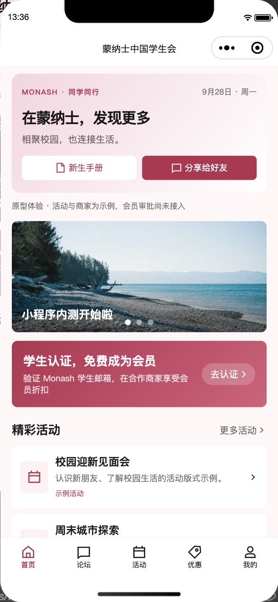
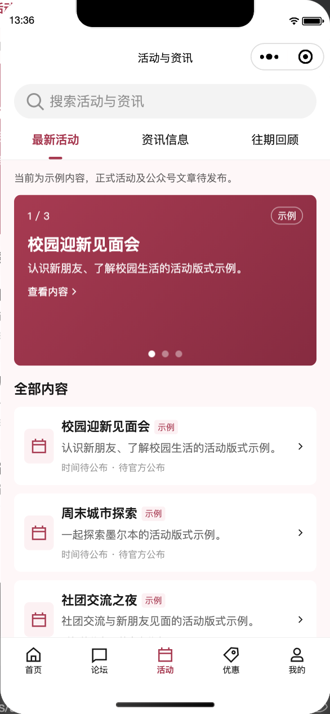
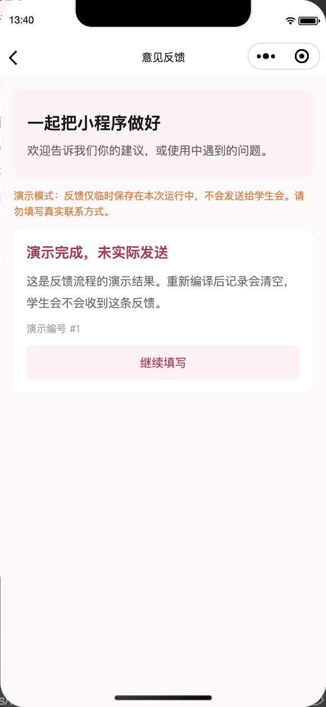
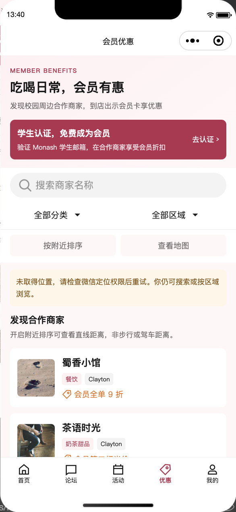
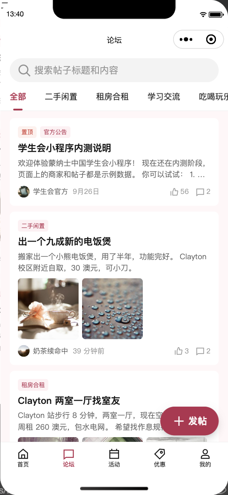
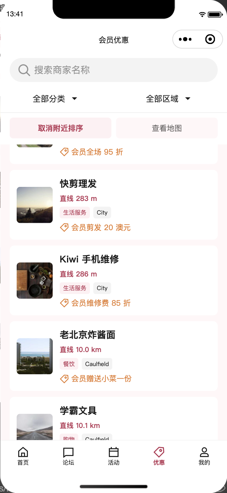
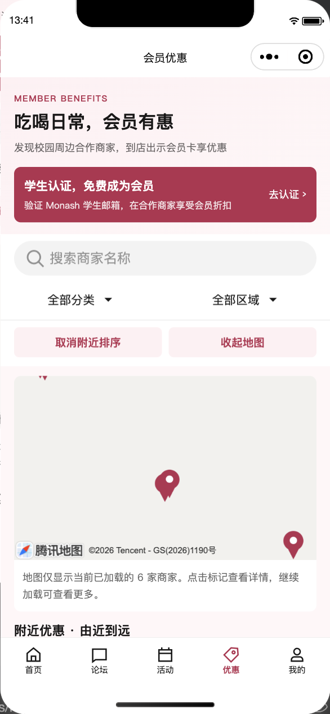

# 工作规划对齐第一批：验证记录

验证日期：2026-09-28。范围为本地前端原型，开发版使用内存 mock。代码位于 `Jiarui/planning-alignment`；本轮未提交、推送、上传体验版或发布。

## 自动检查

以下命令通过：

```sh
npm run typecheck
npm run lint
npm run format:check
npm test
git diff --check
```

单元测试：21 个文件、179 项通过（此前基线为 109 项）。新增覆盖活动分类、搜索、分页与详情错误；支持内容和反馈参数、权限、防重复提交与失败保留草稿；位置有效性、直线距离计算、全量排序后分页和无效查询；首页模块独立加载、过期响应忽略；登录失败时公开商家详情与地图入口仍可用。

这验证的是客户端和 mock 规则，不是线上后端、真实微信身份或持久化。

## 微信开发者工具检查

环境：模拟 iPhone 12/13 (Pro)，390 × 844，基础库 3.17.3。通过开发者工具自动化接口操作页面，人工查看截图。导航和搜索部分使用页面事件方法，反馈内容通过 textarea 输入并点击提交；地图跳转通过触发 marker 事件验证，不等同于真机手势与系统权限测试。

| 流程 | 实际结果 |
| --- | --- |
| 五栏目与首页 | 首页、论坛、活动、优惠、我的均可到达；首页最多显示 3 条活动；可进入活动详情 |
| 活动栏目 | 最新活动、资讯、往期回顾筛选正确；前三条轮播；不存在关键词显示空状态，清除后恢复 |
| 无效分享地址 | 不存在的活动 ID 显示错误，可返回活动栏目 |
| 商家附近排序 | 注入固定测试坐标后按直线距离递增排序；分类筛选、取消附近排序通过 |
| 拒绝位置授权 | 注入拒绝回调后显示降级提示；仍可搜索商家，无重复强制弹窗 |
| 地图 | 商家标记事件可打开对应详情；等待 8 秒后仍只有标记、未显示底图，完整地图能力未通过验收 |
| 我的 → 手册 → 联系 | 可到达；示例手册提示可见；未配置的官网与微信号没有虚构链接 |
| 意见反馈 | 输入有效内容可提交；结果明确显示“演示完成，未实际发送”，不会声称学生会已收到 |
| 论坛 | 保留列表与入口；发布浮动按钮在五栏导航上方，未遮挡导航 |

定位成功/拒绝通过测试替身触发，不能据此确认用户系统权限、平台审核或真实定位精度。手册、联系、反馈与论坛完成检查的那次运行未捕获到小程序运行时 exception。测试注入已恢复。

## 页面证据

| 首页 | 活动 | 反馈结果 |
| --- | --- | --- |
|  |  |  |

| 拒绝定位后的提示 | 论坛导航与发帖按钮 |
| --- | --- |
|  |  |

| 直线距离列表 | 地图底图待解决 |
| --- | --- |
|  |  |

## 尚未验收或实现

- 真机隐私同意、位置授权、拒绝后重新开启及真实导航；模拟器地图底图问题仍未定位。当前是微信原生地图，OSM/Mapbox 尚未接入。
- 正式公众号文章打开、分享卡片在微信会话中的显示；没有真实文章链接或外发分享测试。
- 正式天气、汇率、排名、领馆公告、有效会员统计、Wallet 和完整设置页。
- 真实后端、会员人工审核、管理员微信登录、角色权限、内容管理、持久化反馈；旧邮箱自动认证仍仅为演示。
- 正式手册、Logo、联系方式、商家资料及隐私文本；示例内容不能作为正式服务信息。
- 更小屏幕、Android、字体放大、弱网及真实后端错误联调。此轮截图只证明上述模拟器环境的布局。

下一阶段按[工作规划对齐计划](../plans/2026-09-28-planning-alignment.md)先实现会员申请/审核和后台权限契约，再推进真实服务与设备联调。
