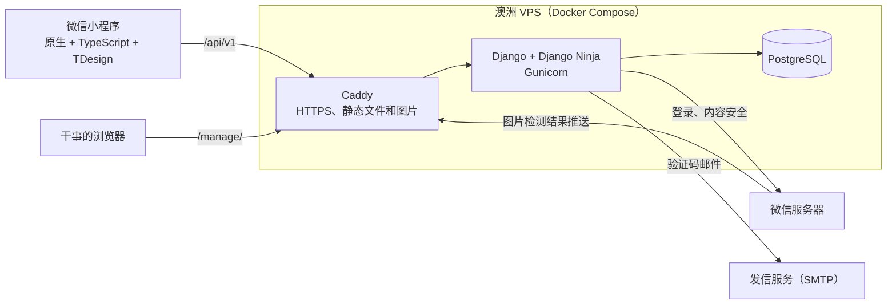
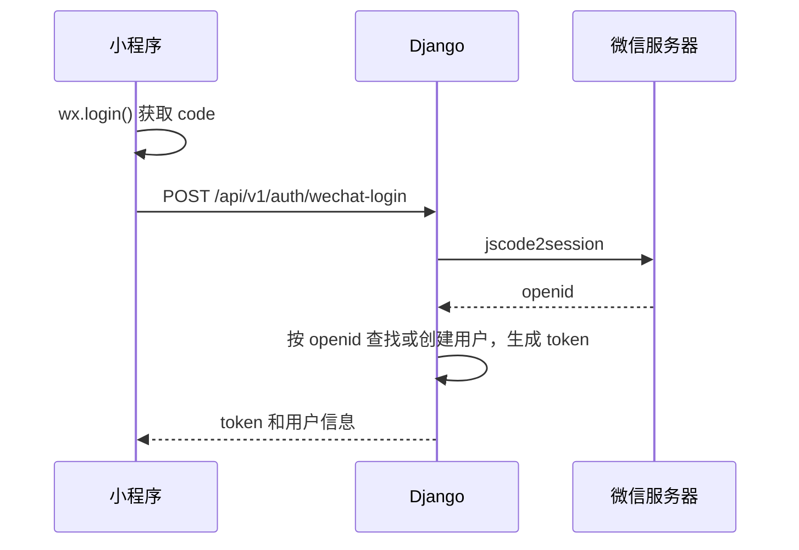
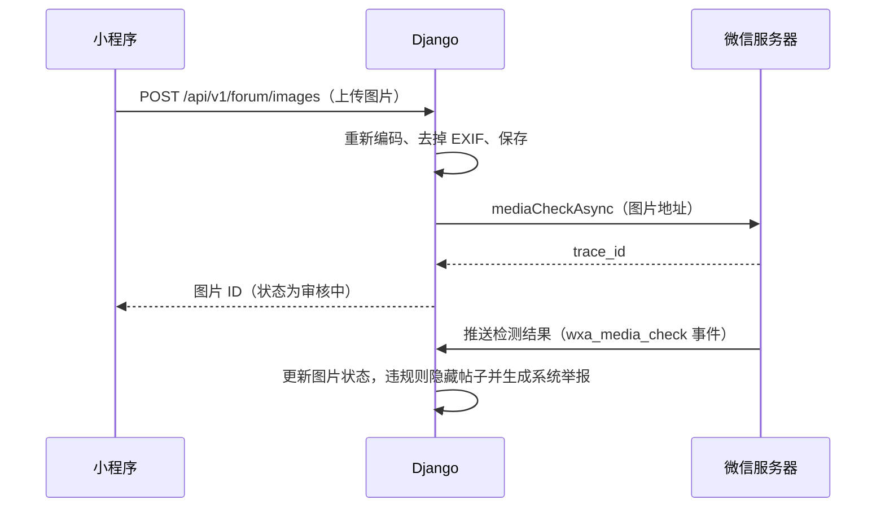

# 蒙纳士中国学生会小程序：技术方案

> **基础设施约束（2026-09-28）：** 用户明确不依赖微信云资源。测试方案采用 Google Cloud Run + Supabase PostgreSQL，保留 Google Cloud SQL 迁移能力；不接入微信云开发、云函数、云托管、云数据库或云存储。小程序使用普通 HTTPS API，微信登录和内容检测作为平台接口单独接入。实施步骤见[部署方案](../deploy/README.md)。

> **数据库托管决定（2026-09-28）：** 为 Supabase PostgreSQL / Google Cloud SQL for PostgreSQL 保持兼容，后端通过标准 Django ORM 连接，前端不绑定托管商。配置、维护窗口搬迁和回滚步骤见[数据库迁移说明](database-migration.md)。下方单机数据库部署图保留为早期方案，不再是托管约束。

> 最新内容与审核实现见[第三批说明](plans/2026-09-28-content-backend.md)，本文保留早期需求和设计背景。

> **会员与权限最新实现：** 见[本地会员后台说明](plans/2026-09-28-membership-backend.md)。邮箱验证改为待审核，禁止自动转移会员；配对登录和管理权限已在本地实现，旧版自动认证/密码后台描述不再适用。

> 版本 v0.1（草稿），2026-09-24。
> **2026-09-28 设计变更：** 本文描述第 0 期基线。活动、支持内容、反馈和附近商家的新增接口，以及人工会员审批、微信管理员登录、后台权限的后续设计见[规划对齐记录](plans/2026-09-28-planning-alignment.md)。下文邮箱验证直接入会、管理员用户名密码登录和后台不配置权限的描述均需在真实后端阶段替换。
> 这份文档写给小程序组的开发同学，说明「怎么做」。功能需求见[需求文档](./requirements.md)，两份文档对不上时，以需求文档为准。

## 1. 技术选型

| 部分 | 选型 | 理由 |
| --- | --- | --- |
| 小程序 | 原生小程序 + TypeScript + TDesign 小程序组件库 | 官方写法，教程最多，基础一般的同学照着官方文档就能写；TypeScript 让接口字段写错时编译就报错 |
| 后端 | Python 3.12 + Django 5.2（长期支持版）+ Django Ninja | Django 自带管理后台、用户权限和数据库迁移；Django Ninja 写接口简洁，并能自动生成 OpenAPI 接口文档 |
| 数据库 | 标准 PostgreSQL；Supabase 或 Google Cloud SQL 托管 | 保留 Django migrations，避免供应商专属接口；具体主版本在部署时确定并回归 |
| 部署 | Google Cloud Run；数据库独立托管于 Supabase | 标准容器和 HTTPS API，不依赖微信云资源；后续可迁至 Google Cloud SQL |
| 邮件 | 任意支持 SMTP 的发信服务（如 Resend、Brevo） | 走 Django 自带的邮件接口，换服务商只需要改配置 |
| 工具 | uv、Ruff、pytest；npm、ESLint、Prettier、openapi-typescript | |

有两件事刻意不做：

- **不依赖微信云资源**：遵循用户明确的托管选择，采用独立后端和标准 PostgreSQL；不以微信云产品的主体资格作为选型依据。
- **不引入 Redis 和 Celery**：按学生会的用户规模，验证码限流和 access_token 缓存放在数据库里就够了。少一个组件，就少一份运维负担。

## 2. 整体架构



- 小程序只和 `https://<域名>/api/v1` 通信。图片也从同一个域名的 `/media/` 下载，所以只需要在小程序后台配置一个服务器域名。
- 干事在浏览器里访问管理后台 `https://<域名>/manage/`。
- 后端调用微信的接口完成登录和内容安全检测；图片的检测结果由微信通过「消息推送」回调给后端。

## 3. 仓库结构

```text
.
├── miniprogram/              # 小程序源码，对应 project.config.json 里的 miniprogramRoot
│   ├── app.ts、app.json、app.wxss
│   ├── config.ts             # 运行环境、接口地址、是否使用假数据
│   ├── custom-tab-bar/       # 底部标签栏，基于 TDesign 的 t-tab-bar
│   ├── pages/                # 每个页面一个目录，见 4.1 节
│   ├── components/           # 公共组件：商家卡片、帖子卡片
│   ├── services/
│   │   ├── request.ts        # 请求封装
│   │   ├── auth.ts           # 静默登录、token 读写、当前用户状态
│   │   ├── api/              # 按模块划分的接口函数
│   │   └── mock/             # 假接口和假数据
│   ├── styles/               # icon-font.wxss：裁剪后内嵌的图标字体，由脚本生成
│   ├── types/                # 接口类型，见 4.3 节
│   └── utils/                # 格式化、校验、会员状态文案等纯函数
├── tests/miniprogram/        # 前端单元测试（Vitest），目录结构和 miniprogram/ 对应
├── scripts/                  # build-icon-font.mjs：生成内嵌图标字体
├── server/
│   ├── pyproject.toml        # Python 依赖，用 uv 管理
│   ├── manage.py
│   ├── config/               # settings、urls、wsgi
│   ├── apps/                 # 各 Django 应用，见 5.1 节
│   └── tests/
├── deploy/                   # docker-compose.yml、Caddyfile、.env.example、发布和备份脚本
├── docs/                     # 需求文档、技术方案、贡献指南、测试清单、实施计划
├── .github/workflows/        # CI
├── package.json              # TDesign 依赖和前端工具链（TypeScript、ESLint、Prettier、Vitest；第 1 期加 openapi-typescript）
├── tsconfig.json、eslint.config.mjs、vitest.config.ts、.prettierrc
└── project.config.json
```

`project.config.json` 里的 `miniprogramRoot` 指向 `miniprogram/`。TDesign 通过根目录的 `package.json` 安装，在开发者工具里「构建 npm」时输出到 `miniprogram/miniprogram_npm/`，这个目录不提交到 git。

## 4. 小程序前端

### 4.1 页面

| 目录 | 页面 | 接入真接口 |
| --- | --- | --- |
| `pages/home` | 首页（标签页） | 第 1 期 |
| `pages/merchants` | 商家列表（标签页） | 第 1 期 |
| `pages/merchant-detail` | 商家详情 | 第 1 期 |
| `pages/forum` | 论坛首页（标签页） | 第 2 期 |
| `pages/post-detail` | 帖子详情和评论 | 第 2 期 |
| `pages/post-create` | 发帖 | 第 2 期 |
| `pages/profile` | 我的（标签页） | 第 1 期 |
| `pages/verify` | 学生邮箱认证 | 第 1 期 |
| `pages/member-card` | 电子会员卡 | 第 1 期 |
| `pages/my-posts` | 我的帖子 | 第 2 期 |
| `pages/about` | 关于我们 | 第 1 期 |
| `pages/agreement` | 用户协议和隐私政策（按参数切换） | 第 1 期 |

第 0 期所有页面都先用假数据做出来。主包超过 1.5 MB 时，再把论坛相关页面拆成分包。

### 4.2 接口层和假数据

页面不直接调用 `wx.request`，而是调用 `services/api/` 里按模块封装好的函数，比如 `listMerchants(params)`。所有请求都经过 `services/request.ts`，它负责：

- 根据运行环境（开发版、体验版、正式版）选择接口地址；
- 带上 `Authorization: Bearer <token>`；
- 收到 `UNAUTHORIZED` 时自动重新静默登录，并重试一次；
- 把失败的响应统一转换成 `ApiError`（包含 `code` 和 `message`）；
- 当 `config.ts` 的 `isMockEnabled()` 返回 `true` 时，不发网络请求，而是交给 `services/mock/` 里对应的假接口处理，并模拟 300 毫秒左右的延迟。

假数据和真接口使用同一套类型，字段写错时 TypeScript 会直接报错。`isMockEnabled()` 只有在 `MOCK_IN_DEVELOP` 为 `true` 且运行在开发版时才返回 `true`，体验版和正式版一律走真接口；第 1 期联调时把 `MOCK_IN_DEVELOP` 改成 `false` 即可。

### 4.3 接口类型

- **第 0 期**：手写 `types/api.ts`，内容和本文 5.3 节的接口清单一致。它就是前后端之间的约定。
- **第 1 期起**：后端用 Django Ninja 实现同样的接口，并自动生成 OpenAPI 文档；`npm run gen:api` 用 openapi-typescript 把它转换成 `types/api.gen.ts`，`types/api.ts` 改成从生成文件导出同名类型。页面代码的 import 不用改；如果前后端字段不一致，`tsc` 会报错。

### 4.4 错误处理

- 后端统一返回 `{ "code": "MEMBERSHIP_REQUIRED", "message": "请先完成学生认证" }` 这样的错误格式，`code` 的取值见 5.3 节。Django Ninja 默认的参数校验错误也要转换成这个格式。
- 前端把 `code` 定义成字符串联合类型。需要按错误码分别处理的地方用 `switch`，并在 `default` 分支里做 `never` 检查，这样后端新增错误码时，编译器会指出哪些地方还没处理。
- 默认处理是用 `wx.showToast` 显示 `message`；网络错误统一提示「网络不太好，请稍后再试」。

### 4.5 其他约定

- 页面目录用小写字母加连字符命名，比如 `merchant-detail`。
- 品牌色、字号和间距统一定义在 `app.wxss` 的 CSS 变量里，并覆盖 TDesign 的主题变量。拿到学生会的视觉规范后，只需要改这一个地方。
- 用户选图用 TDesign 的 `t-upload`（内部调用 `wx.chooseMedia`），并开启压缩。
- 不引入状态管理库。登录状态和会员状态统一从 `services/auth.ts` 读取；发帖、删帖、点赞、评论后用 `utils/refresh.ts` 标记相关列表，列表页在 `onShow` 里发现标记才刷新，避免每次切回来都重新加载、丢掉滚动位置。
- 发帖、评论、点赞、举报前调用 `utils/guard.ts` 的 `ensureMember()`，不是有效会员时弹窗引导去认证。
- 头像昵称用 `<button open-type="chooseAvatar">` 和 `<input type="nickname">`。
- 地图导航用 `wx.openLocation`。澳洲境内的 GCJ-02 坐标和 WGS-84 坐标一致，干事可以直接从 Google Maps 复制经纬度。
- 底部标签栏用 TDesign 的 `t-tab-bar` 自定义实现（`custom-tab-bar/`），每个标签页在 `onShow` 里调用 `syncTabBar()` 同步选中项。
- 图标：TDesign 默认从腾讯 CDN 在线加载整套图标字体，从澳洲访问时快时慢（实测最慢一次要 76 秒），开发者工具里也经常显示不出来。所以用 `scripts/build-icon-font.mjs` 把字体裁剪成用到的图标，以 base64 内嵌到 `styles/icon-font.wxss`，由 `app.wxss` 引入。新增图标的方法见[贡献指南](./contributing.md)。

## 5. 后端

### 5.1 Django 应用

| 应用 | 负责 |
| --- | --- |
| `accounts` | 用户、微信登录、token、头像昵称、注销 |
| `membership` | 学生邮箱验证码、会员资格 |
| `merchants` | 商家、分类、区域 |
| `content` | 首页轮播图 |
| `forum` | 板块、帖子、评论、点赞、举报 |
| `wechat` | 微信接口客户端（登录、access_token、内容安全）和消息推送回调 |

每个应用内部按 `models.py`、`admin.py`、`schemas.py`（接口的请求和响应结构）、`api.py`（接口）、`services.py`（业务逻辑）组织。接口函数只做参数解析和权限判断，业务逻辑写在 `services.py` 里，方便单独测试。

### 5.2 数据模型

**accounts**

- `User`：自定义用户模型。项目一开始就要设置 `AUTH_USER_MODEL`，否则以后很难改。在 Django 自带字段之外，增加 `nickname`、`avatar`、`avatar_check_status`、`banned_until`、`deleted_at`。小程序用户没有密码；干事用用户名和密码登录管理后台。
- `WechatIdentity`：`user`、`appid`、`openid`、`created_at`、`last_login_at`，其中 (`appid`, `openid`) 组合唯一。记录 `appid` 是为了切换到学生会账号后，新旧账号的 openid 可以共存。
- `AuthToken`：`user`、`token_hash`、`created_at`、`expires_at`、`last_used_at`。数据库只存 token 的 SHA-256 哈希，有效期 30 天。

**membership**

- `Membership`：`user`（一对一）、`email`（唯一，统一小写）、`verified_at`、`expires_at`、`revoked_at`、`revoke_reason`。会员编号直接用这条记录的主键，显示成 6 位数字（比如 `000123`）；会员资格转移时只改 `user`，编号不变。未被取消且 `expires_at` 晚于当前时间，才算有效会员。
- `EmailCode`：`email`、`user`、`code_hash`、`attempts`、`expires_at`、`used_at`、`created_at`。

**merchants**

- `Category`、`Area`：`name`、`sort_order`、`is_active`。
- `Merchant`：`name`、`category`、`area`、`logo`、`intro`、`discount_summary`、`discount_terms`、`address`、`latitude`、`longitude`、`phone`、`opening_hours`、`is_featured`、`is_active`、`sort_order`、`created_at`、`updated_at`。
- `MerchantImage`：`merchant`、`image`、`sort_order`。

**content**

- `Banner`：`title`、`image`、`link_type`（`none` / `merchant` / `post`）、`link_id`、`starts_at`、`ends_at`、`sort_order`、`is_active`。

**forum**

- `Board`：`name`、`intro`、`sort_order`、`is_active`、`staff_only`（为 `true` 时只有干事能发帖，用于官方公告）。
- `Post`：`board`、`author`、`title`、`content`、`status`（`published` / `hidden` / `deleted`）、`hidden_reason`、`is_pinned`、`like_count`、`comment_count`、`created_at`。
- `PostImage`：`post`（上传时为空，发帖时关联）、`uploader`、`image`、`check_status`（`pending` / `pass` / `risky`）、`trace_id`、`sort_order`、`created_at`。
- `Comment`：`post`、`author`、`reply_to_user`、`content`、`status`、`created_at`。
- `PostLike`：`post`、`user`，二者组合唯一。
- `Report`：`reporter`（为空表示系统自动生成）、`post` 或 `comment`（二选一）、`reason`、`detail`、`status`（`pending` / `hidden` / `rejected`）、`handled_by`、`handled_at`、`created_at`。

帖子和评论的删除都是把 `status` 改成 `deleted`，不物理删除，这样举报记录还能找到原内容。`like_count` 和 `comment_count` 在点赞、评论的同一个数据库事务里更新。

### 5.3 接口清单

所有接口都在 `/api/v1` 下，使用 JSON。除了健康检查、登录和微信回调，其他接口都要带 token。列表接口统一用游标分页：请求带 `cursor` 和 `limit`（默认 20），返回 `{ "items": [...], "next_cursor": "..." }`，`next_cursor` 为 `null` 表示没有更多数据。

「权限」一列中，「登录」表示任何已登录用户，「会员」表示有效会员且不在禁言期，「作者」表示内容的发布者本人。

| 方法 | 路径 | 说明 | 权限 |
| --- | --- | --- | --- |
| GET | `/health` | 健康检查 | 无 |
| POST | `/auth/wechat-login` | 用 `wx.login` 拿到的 code 换 token | 无 |
| GET | `/me` | 当前用户信息和会员状态（会员卡页也用这个接口） | 登录 |
| PUT | `/me` | 修改昵称（`wx.request` 不支持 PATCH，所以用 PUT） | 登录 |
| POST | `/me/avatar` | 上传头像 | 登录 |
| DELETE | `/me` | 注销账号 | 登录 |
| POST | `/membership/email-code` | 发送验证码 | 登录 |
| POST | `/membership/verify` | 提交验证码，完成认证或续期 | 登录 |
| GET | `/home` | 轮播图和精选商家 | 登录 |
| GET | `/merchants/filters` | 分类和区域列表 | 登录 |
| GET | `/merchants` | 商家列表，参数 `category`、`area`、`q` | 登录 |
| GET | `/merchants/{id}` | 商家详情 | 登录 |
| GET | `/forum/boards` | 板块列表 | 登录 |
| GET | `/forum/posts` | 帖子列表，参数 `board`、`q`、`author=me` | 登录 |
| POST | `/forum/images` | 上传帖子图片，返回图片 ID | 会员 |
| POST | `/forum/posts` | 发帖：板块、标题、正文、图片 ID 列表 | 会员 |
| GET | `/forum/posts/{id}` | 帖子详情 | 登录 |
| DELETE | `/forum/posts/{id}` | 删除帖子 | 作者 |
| GET | `/forum/posts/{id}/comments` | 评论列表 | 登录 |
| POST | `/forum/posts/{id}/comments` | 发评论，可带 `reply_to_user_id` | 会员 |
| DELETE | `/forum/comments/{id}` | 删除评论 | 作者 |
| PUT | `/forum/posts/{id}/like` | 点赞 | 会员 |
| DELETE | `/forum/posts/{id}/like` | 取消点赞 | 会员 |
| POST | `/forum/reports` | 举报帖子或评论 | 会员 |
| GET、POST | `/wechat/push` | 微信消息推送回调 | 微信签名 |

错误码：

| `code` | HTTP 状态码 | 含义 |
| --- | --- | --- |
| `UNAUTHORIZED` | 401 | 没带 token，或 token 已失效 |
| `FORBIDDEN` | 403 | 没有权限，比如删除别人的帖子 |
| `MEMBERSHIP_REQUIRED` | 403 | 需要有效会员 |
| `USER_BANNED` | 403 | 在禁言期内 |
| `NOT_FOUND` | 404 | 资源不存在或已被隐藏 |
| `ALREADY_MEMBER` | 409 | 当前微信号已经用另一个邮箱认证过 |
| `RENEWAL_NOT_OPEN` | 409 | 距离到期还超过 30 天，暂时不能续期 |
| `MEMBERSHIP_REVOKED` | 409 | 会员资格已被取消，需要联系学生会 |
| `VALIDATION_ERROR` | 422 | 参数不合法 |
| `EMAIL_DOMAIN_NOT_ALLOWED` | 422 | 不是允许认证的邮箱域名 |
| `CODE_INVALID` | 422 | 验证码错误、已过期或已作废 |
| `CONTENT_RISKY` | 422 | 内容没有通过安全检测 |
| `RATE_LIMITED` | 429 | 操作太频繁 |
| `INTERNAL_ERROR` | 500 | 服务器内部错误 |

### 5.4 登录



- 不保存 `session_key`，第一版用不到解密手机号之类的能力。
- 同一个微信号在同一个 AppID 下的 openid 固定不变，所以登录就是「按 openid 找用户，找不到就新建」。
- token 有效期 30 天；过期后前端会自动重新登录，用户感觉不到。
- 注销账号时：清空昵称和头像，删除 `Membership`、`EmailCode`、所有 token 和 `WechatIdentity`，并记录 `deleted_at`。帖子和评论保留，作者显示为「已注销用户」。同一个微信号之后再打开小程序，会作为新用户登录。

### 5.5 学生邮箱认证

**发送验证码**（`POST /membership/email-code`）

1. 邮箱去掉首尾空格并转成小写，校验域名在 `MEMBERSHIP_ALLOWED_EMAIL_DOMAINS` 里（默认只有 `student.monash.edu`）。
2. 检查限流：同一个邮箱 60 秒内只能发一次、每天最多 10 次；同一个用户每天最多 10 次。
3. 用 Python 的 `secrets` 模块生成 6 位数字，数据库里只保存它的 HMAC 哈希，10 分钟后过期。
4. 通过 SMTP 同步发送邮件。发送失败时返回 `INTERNAL_ERROR`，并删掉这条验证码。

**提交验证码**（`POST /membership/verify`）

取这个邮箱最近一条未使用、未过期的验证码进行比对。比对失败则 `attempts` 加 1，满 5 次作废。比对成功后，在同一个数据库事务里按下表从上到下判断，命中第一条就按它处理：

| 情况 | 处理 |
| --- | --- |
| 这个邮箱的会员资格已被取消 | 拒绝，返回 `MEMBERSHIP_REVOKED` |
| 当前用户已经用另一个邮箱认证过 | 拒绝，返回 `ALREADY_MEMBER` |
| 这个邮箱还没有会员记录 | 新建会员，有效期 12 个月 |
| 这个邮箱的会员属于当前用户 | 续期：只有距离到期不足 30 天或已经过期时才允许，新到期日为「原到期日和现在两者中较晚的那个」加 12 个月；否则返回 `RENEWAL_NOT_OPEN` |
| 这个邮箱的会员属于其他用户 | 转移给当前用户，会员编号和到期日不变 |

### 5.6 内容安全

**文字**：发帖、评论和修改昵称时，后端先调用微信的 `msgSecCheck`（2.0 版本），带上用户的 openid 和对应场景（资料是 1、评论是 2、论坛是 3）。根据返回的 `suggest` 处理：

- `risky`：拒绝发布，返回 `CONTENT_RISKY`。
- `review`：正常发布，同时生成一条系统举报，交给版主复核。
- `pass`：正常发布。
- 微信接口调用失败：按 `review` 处理，避免微信接口临时故障时整个论坛发不了帖。

**图片**：



- 帖子图片和头像都走异步检测。结果出来之前，只有上传者本人能看到这张图（显示「审核中」）；接口不会把这张帖子图片返回给其他人，头像则对其他人显示默认头像。
- 图片被判定为 `risky` 时，这张图隐藏；如果是帖子图片，整个帖子同时隐藏，并生成系统举报。
- 超过 1 小时还没收到检测结果的图片，可以在管理后台用筛选条件列出来，由版主人工判断。
- 消息推送在小程序后台的「开发设置 → 消息推送」里配置：URL 填 `https://<域名>/api/v1/wechat/push`，数据格式选 JSON。第一版用明文模式，靠签名校验确认请求来自微信。

**access_token**：调用微信服务端接口需要的 access_token 通过 `getStableAccessToken`（稳定版接口）获取，缓存在 Django 的数据库缓存里，过期前 5 分钟刷新。

### 5.7 图片上传和存储

- 只接受 JPG、PNG、WebP，单张不超过 5 MB。
- 后端用 Pillow 重新编码：有透明背景的 PNG 保持 PNG，其余转成 JPEG。重新编码会去掉 EXIF 信息（照片里可能带拍摄地点），同时把长边缩到 2048 像素以内。
- 文件存在 `MEDIA_ROOT/<年>/<月>/<随机文件名>`，由 Caddy 直接对外提供。
- 上传后 24 小时内没有被发帖使用的图片，由每天运行一次的定时任务删除。
- 商家图片和轮播图由干事在管理后台上传，同样重新编码，但不做内容安全检测。

### 5.8 管理后台和权限

- 路径由配置项 `ADMIN_URL_PATH` 决定（默认 `manage/`），不用 Django 默认的 `admin/`，减少被自动扫描。
- `LANGUAGE_CODE = "zh-hans"`，`TIME_ZONE = "Australia/Melbourne"`。
- 用 Django 的用户组实现四种角色，每组只分配对应模型的权限：

| 用户组 | 权限范围 |
| --- | --- |
| 技术负责人 | 超级用户，全部权限 |
| 内容管理员 | `Merchant`、`MerchantImage`、`Category`、`Area`、`Banner` |
| 版主 | `Board`、`Post`、`PostImage`、`Comment`、`Report` |
| 会员管理员 | `Membership`（查看、取消） |

- 给版主准备的批量操作：隐藏、恢复、置顶、取消置顶、禁言作者 1 / 7 / 30 天、把举报处理为「隐藏内容」或「驳回」。禁言通过帖子、评论和举报列表里的批量操作完成，所以版主不需要用户表的修改权限。
- Django 会自动记录每一次后台操作（`LogEntry`），出了问题可以追溯是谁改的。
- 用户组和权限通过数据迁移（data migration）创建，不在后台手动配置。

### 5.9 配置和密钥

所有配置都从环境变量读取。本地放在 `server/.env`，服务器上放在 `deploy/.env`，这两个文件都不提交到 git；仓库里只放不含真实值的 `.env.example`。

| 变量 | 说明 |
| --- | --- |
| `DJANGO_SECRET_KEY` | Django 密钥，也用来计算验证码哈希 |
| `DJANGO_DEBUG` | 本地为 `true`，线上为 `false` |
| `DJANGO_ALLOWED_HOSTS` | 允许访问的域名 |
| `DATABASE_URL` | PostgreSQL 连接串 |
| `WECHAT_APPID`、`WECHAT_APPSECRET` | 小程序的 AppID 和 AppSecret |
| `WECHAT_PUSH_TOKEN` | 消息推送的 Token |
| `EMAIL_BACKEND` | 本地用 Django 的 console 后端，验证码直接打印在终端里；线上用 SMTP 后端 |
| `EMAIL_HOST`、`EMAIL_PORT`、`EMAIL_HOST_USER`、`EMAIL_HOST_PASSWORD`、`DEFAULT_FROM_EMAIL` | 发信服务的 SMTP 配置 |
| `MEMBERSHIP_ALLOWED_EMAIL_DOMAINS` | 允许认证的邮箱域名，逗号分隔，默认 `student.monash.edu` |
| `ADMIN_URL_PATH` | 管理后台路径 |
| `MEDIA_BASE_URL` | 图片的访问地址前缀 |

## 6. 部署和运维

- **服务器**：澳洲机房（悉尼或墨尔本）的 VPS，Ubuntu LTS，2 GB 内存起步。
- **容器**：Docker Compose 跑三个服务：
  - `caddy`：监听 80 和 443 端口，自动申请 HTTPS 证书，把接口和管理后台的请求转发给 Django，并直接提供 `/static/` 和 `/media/`；
  - `web`：Django + Gunicorn；
  - `db`：PostgreSQL 17，数据放在 Docker volume 里。
- **发布**：在服务器上依次执行 `git pull`、`docker compose build`、`docker compose run --rm web python manage.py migrate`、`docker compose up -d`。第一版手动发布，命令写成 `deploy/release.sh`；以后再考虑用 GitHub Actions 自动发布。
- **备份**：每天凌晨用 cron 导出数据库（`pg_dump`）并打包图片目录，用 rclone 上传到服务器以外的对象存储（比如 Cloudflare R2 或 Backblaze B2），保留 30 天。每学期至少做一次恢复演练，确认备份真的能用。
- **监控**：用 UptimeRobot 免费版每 5 分钟访问一次 `/api/v1/health`，服务挂了会发邮件提醒；Django 的报错通过 `ADMINS` 配置发邮件给技术负责人。以后需要时再接 Sentry。
- **环境**：只有本地开发和线上两套。本地用 Docker 跑 PostgreSQL，Django 用 `runserver`；微信开发者工具勾选「不校验合法域名」，直连本地后端。
- **域名**：需要一个自己的域名，比如用 `api.<域名>` 给后端。发信服务也要用这个域名配置 SPF 和 DKIM，否则验证码邮件容易进垃圾箱。

## 7. 开发流程和多人协作

- **仓库**：GitHub 私有仓库，先放在技术负责人的个人账号下。私有仓库开分支保护需要 GitHub Pro，用 Monash 学生身份申请 GitHub Student Developer Pack 可以免费获得。换届时把仓库转移给下一任技术负责人，或者转到学生会的 GitHub 组织。
- **分支**：`main` 始终保持可发布。每个任务从 `main` 拉一个分支，命名为 `feat/<简短描述>` 或 `fix/<简短描述>`；做完提 PR，CI 通过并由技术负责人 review 后，用 squash 方式合并。
- **CI**（GitHub Actions）：
  - 后端：`uv sync`、`ruff check`、`ruff format --check`、`pytest`（用 PostgreSQL 服务容器）；
  - 前端：`npm ci`、类型检查、ESLint、Prettier 格式检查、Vitest 单元测试（第 0 期已配置好，见 `.github/workflows/ci.yml`）。
- **代码规范**：Python 用 Ruff 检查并写类型注解；TypeScript 开启 `strict`；格式统一交给 Ruff 和 Prettier 自动处理，不在 review 里争论格式。
- **小程序后台权限**：技术负责人是管理员；组员要加为「开发者」才能预览和上传代码；只有技术负责人能提交审核和发布。
- **贡献指南**：[docs/contributing.md](./contributing.md) 写清楚了怎么装环境、怎么建分支、怎么提 PR，以及常见问题。

## 8. 测试

**后端**：pytest + pytest-django，测试放在 `server/tests/`。微信接口和邮件发送在测试里都用假实现，不真的调用。重点覆盖：

- 登录：新用户创建、老用户复用、code 无效。
- 验证码：邮箱域名校验、60 秒冷却、每天上限、10 分钟过期、输错 5 次作废。
- 会员：新建、续期窗口、到期判断、转移、被取消后不能重新认证、一个用户不能绑两个邮箱。
- 论坛权限：访客、过期会员和禁言用户不能发帖；只有作者能删除；`staff_only` 板块只有干事能发帖。
- 内容安全：`risky` 被拦截；`review` 和接口调用失败会生成系统举报；图片回调能更新状态；违规图片会让帖子隐藏。

**前端**：`services/` 和 `utils/` 里的纯逻辑（请求封装、假接口的业务规则、格式化、会员状态文案）用 Vitest 写单元测试，放在 `tests/miniprogram/`。页面靠 `tsc`、ESLint 和[手动测试清单](./test-checklist.md)把关：合并前在开发者工具里过一遍，发体验版前在 iOS 和 Android 真机上各过一遍。

**不做**：小程序自动化界面测试（miniprogram-automator），投入产出比太低。

## 9. 分工建议

下面是给项目经理分配任务时参考的拆分方式。标「组员」的任务都可以对着假数据独立完成，互相之间不依赖。

**第 0 期：工程底座和假数据原型**

工程底座和全部 12 个页面的可点击原型已由技术负责人完成，方便先拿去演示、对齐需求。组员在第 0 期的任务是把原型打磨成可上线的质量：

| 任务 | 负责人 | 内容 |
| --- | --- | --- |
| 首页、商家列表、商家详情打磨 | 组员 | 加载骨架屏、接口出错时的重试提示、空状态、图片加载失败的占位、真机适配 |
| 我的、关于我们、协议页打磨 | 组员 | 头像上传中的状态、昵称修改的交互细节、学生会提供正式文案后替换示例文字 |
| 学生认证和会员卡打磨 | 组员 | 表单报错提示、倒计时和按钮状态的细节、会员卡动画在真机上的流畅度 |
| 论坛首页和发帖打磨 | 组员 | 列表加载和空状态、发帖草稿保存、图片上传失败后的重试 |
| 帖子详情和评论打磨 | 组员 | 评论输入框和键盘的配合、长按菜单、删除和举报后的反馈 |
| 测试清单维护 | 组员 | 按页面实际表现补充 [docs/test-checklist.md](./test-checklist.md)，并在 iOS 和 Android 真机上各跑一遍 |

**第 1 期：后端和联调**

| 任务 | 负责人 |
| --- | --- |
| Django 骨架、自定义用户模型、登录和 token | 技术负责人 |
| 学生邮箱认证和会员逻辑 | 技术负责人 |
| 服务器部署、备份和监控 | 技术负责人 |
| 商家、分类、区域的模型、后台和接口 | 组员（参照技术负责人写好的第一个模块） |
| 首页轮播图的模型、后台和接口 | 组员 |
| 各页面从假数据切换到真接口 | 各页面的原作者 |

**第 2 期：论坛后端**

| 任务 | 负责人 |
| --- | --- |
| 内容安全和消息推送回调 | 技术负责人 |
| 板块、帖子、评论、点赞的模型和接口 | 组员，技术负责人 review |
| 举报队列和版主批量操作 | 组员 |

## 10. 切换到学生会账号

学生会的境外主体账号注册并认证后：

1. 在新账号后台把技术负责人设为管理员，组员设为开发者。
2. 配置服务器域名和消息推送；填写用户隐私保护指引，声明会收集邮箱、头像昵称、用户从相册选中的图片，以及会使用剪切板；申请服务类目。
3. 修改 `project.config.json` 里的 `appid`，以及服务器 `.env` 里的 `WECHAT_APPID`、`WECHAT_APPSECRET` 和 `WECHAT_PUSH_TOKEN`。
4. 个人账号阶段只做内测，切换前清空内测数据。
5. 提交审核。

## 11. 待验证的技术点

- **境外主体能否配置没有 ICP 备案的域名**：微信的网络文档写的是域名必须经过 ICP 备案，没有写境外主体例外；但微信官方在社区回复过[不限制海外主体的服务器选型](https://developers.weixin.qq.com/community/develop/doc/000604019d04d8d999f366b386d000)。学生会账号下来后，第一件事就是在后台试配域名。
- **微信内置地图在墨尔本的数据是否完整**：如果不完整，就以「复制地址」为主。
- **验证码邮件能否稳定送达 `student.monash.edu` 邮箱**：第 1 期内测前，用几个真实的学生邮箱实测。
